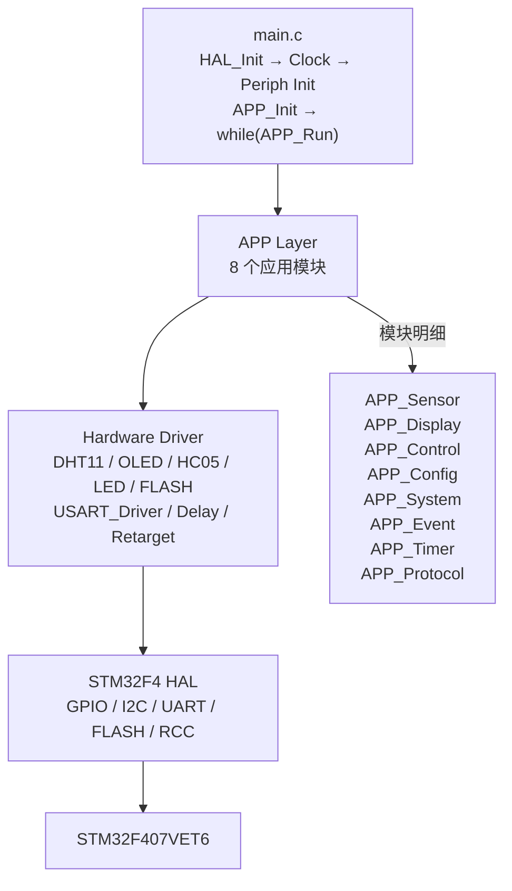
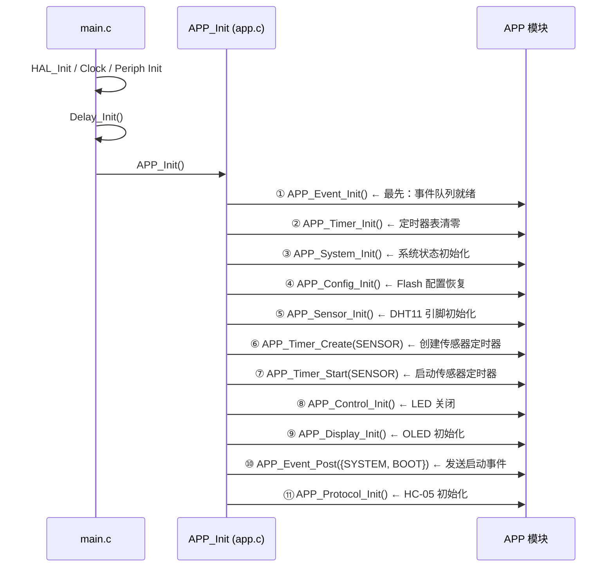
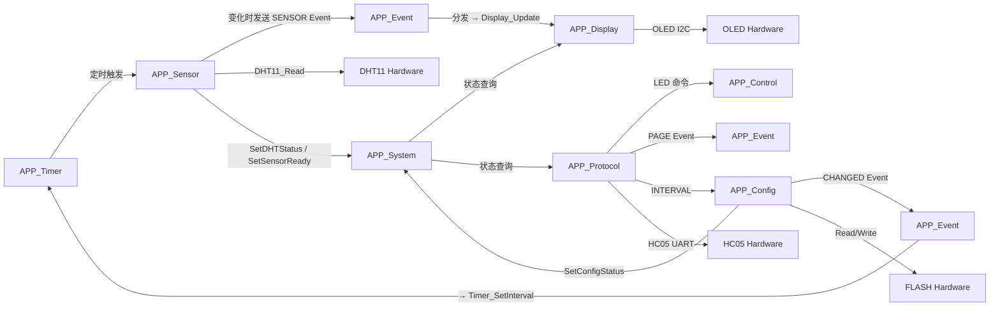

# STM32 Smart Home APP 软件架构总结

> **项目**: STM32F407 智能家居 | **版本**: v0.3 (裸机) | **日期**: 2026-08-02

---

## 1. APP 层简介

APP 层是整个智能家居系统的**业务逻辑核心**，位于 Hardware 驱动层与 Main 主循环之间。

**三层结构：**

```
┌────────────────────────────────────────┐
│  Main Loop (main.c)                    │  ← 系统启动 + 主循环调度
│  APP_Run()                             │
└──────────────┬─────────────────────────┘
               │
┌──────────────▼─────────────────────────┐
│  APP Layer (8 个应用模块)               │  ← 业务逻辑 / 状态管理 / 事件通信
│  Sensor / Display / Control / Config   │
│  System / Event / Timer / Protocol     │
└──────────────┬─────────────────────────┘
               │
┌──────────────▼─────────────────────────┐
│  Hardware Layer (6 个硬件驱动)          │  ← 外设驱动封装
│  DHT11 / OLED / HC05 / LED / FLASH     │
│  USART_Driver / Delay / Retarget       │
└──────────────┬─────────────────────────┘
               │
┌──────────────▼─────────────────────────┐
│  STM32F4 HAL + CMSIS                   │  ← ST 官方库
└────────────────────────────────────────┘
```

**APP 层负责：**

- 业务逻辑编排（传感器采集节奏、命令分发策略）
- 模块调度（Timer 定时 → Sensor 采样 → Event 通知 → Display 刷新）
- 状态管理（DHT 状态 / 蓝牙状态 / 配置状态 / 传感器就绪）
- 事件处理（8 槽位 FIFO 队列，统一分发）
- 数据交互（跨模块数据访问通过统一接口）
- 用户命令解析（蓝牙文本协议 → 8 条命令 → 各模块执行）

**APP 层不直接操作硬件**——所有 GPIO / I2C / UART / Flash 寄存器访问均通过 Hardware 驱动层完成。

---

## 2. 软件整体架构



---

## 3. APP 模块组成

| 模块 | 文件 | 功能 | 依赖 Hardware |
|------|------|------|--------------|
| **APP_Sensor** | `app_sensor.c/h` | 传感器数据管理、变化检测、Event 发送 | `dht11.c` |
| **APP_Display** | `app_display.c/h` | OLED 多页面显示、Dirty Check 刷新控制 | `oled.c` |
| **APP_Control** | `app_control.c/h` | LED 开关控制、状态查询 | `led.c` |
| **APP_Config** | `app_config.c/h` | Flash 双备份配置、CRC32、延迟保存、自动修复 | `flash.c` |
| **APP_System** | `app_system.c/h` | 系统状态中心（DHT/BT/Config/SensorReady） | 无（纯状态管理） |
| **APP_Event** | `app_event.c/h` | 事件队列（8 槽位 FIFO） | 无（纯数据队列） |
| **APP_Timer** | `app_timer.c/h` | 软件定时器（周期/单次） | 无（依赖 `HAL_GetTick`） |
| **APP_Protocol** | `app_protocol.c/h` | 蓝牙文本命令解析（8 条命令） | `hc05.c` |
| **APP_Main** | `app.c/h` | APP 统一入口、初始化串联、主循环调度 | 无（纯调度） |

---

## 4. APP 初始化流程



**初始化顺序设计原则：**

1. **Event + Timer 最先**：其他模块初始化可能需要发送事件或创建定时器
2. **System 在 Config 之前**：Config 加载后需要写入系统状态
3. **Sensor 在 Timer_Create 之前**：Timer 回调需要 Sensor 已就绪
4. **BOOT 事件在 Display + Protocol 初始化之间**：Display 已就绪可响应，Protocol 最后就绪
5. **Protocol 最后**：HC-05 初始化完成后系统即可接收蓝牙命令

---

## 5. APP 运行机制

**主循环**（`main.c`）：

```c
while (1)
{
    APP_Run();
}
```

**`APP_Run()` 执行顺序**（[app.c:79-101](APP/app.c#L79)）：

```c
void APP_Run(void)
{
    APP_Timer_Process();       // ① 定时器调度（最高优先级，保证准时）
    APP_Event_Process();       // ② 事件分发（处理上轮产生的事件）
    APP_Config_Process();      // ③ 配置后台（修复 + 延迟保存）
    APP_Protocol_Process();    // ④ 协议处理（消费蓝牙数据）
}
```

| 步骤 | 函数 | 作用 | 备注 |
|------|------|------|------|
| ① | `APP_Timer_Process()` | 遍历 8 个 Timer，触发到期回调 | 传感器采样在此触发 |
| ② | `APP_Event_Process()` | 从队列取出所有事件，switch 分发 | Display 刷新在此触发 |
| ③ | `APP_Config_Process()` | 优先修复损坏备份 → 延迟保存 Dirty 配置 | Flash 操作耗时 |
| ④ | `APP_Protocol_Process()` | 从 HC-05 RingBuffer 读取并解析命令 | 可能修改配置/发送事件 |

> **注意**：`APP_Sensor_Update()` 和 `APP_Display_Update()` 不在 `APP_Run()` 中直接调用——它们分别由 Timer 回调和 Event 分发间接触发，体现了事件驱动的设计思想。

---

## 6. 模块之间关系



**核心数据流：**

```
Timer → Sensor → Event → Display → OLED       (传感器 → 显示)
Protocol → Config → Event → Timer              (蓝牙命令 → 周期调整)
Protocol → Event → Display                     (蓝牙命令 → 页面切换)
Protocol → Control → LED                       (蓝牙命令 → 硬件控制)
Sensor/Config/Protocol → System → Display      (状态 → 显示)
```

---

## 7. APP 层设计思想

### 模块化

8 个 APP 模块各自独立，通过明确的 `.h` 接口通信。每个 `.c` 文件内的 `static` 变量对外不可见。

### 事件驱动

模块之间不直接调用，而是通过 Event 系统解耦。Sensor 不知道 Display 存在，Protocol 不知道 Timer 存在。

### 数据与显示分离

Display 不直接读取 DHT11——它通过 `APP_Sensor_GetData()` 获取数据，通过 `APP_Control_GetLEDState()` 获取状态。数据来源变更不影响 Display。

### 配置持久化

Config 模块独立管理 Flash 存储（双备份 + CRC32 + Sequence + 自动修复），其他模块通过 `Get/Set` 接口访问参数。

### 易迁移 RTOS

当前裸机架构已具备 RTOS 迁移基础：

| 裸机组件 | RTOS 对应 |
|---------|----------|
| `APP_Timer` | FreeRTOS Software Timer |
| `APP_Event` 队列 | FreeRTOS Queue |
| `APP_Run()` 主循环 | 多个独立 Task |
| `HAL_GetTick` 计时 | `xTaskGetTickCount` |
| `static` 变量 | Task 内局部或全局 Mutex 保护 |

---

## 8. 当前版本特点

**硬件平台**：STM32F407VET6 @ 168MHz, 512KB Flash, 192KB SRAM

**软件架构**：裸机（Bare-metal），STM32F4 HAL 库，Keil MDK

**已实现功能**：

| 功能 | 实现方式 |
|------|---------|
| DHT11 温湿度采集 | GPIO 位带时序 + DWT 微秒延时 |
| SSD1306 OLED 显示 | I2C1 (100kHz)、4 页面、Dirty Check 按需刷新 |
| HC-05 蓝牙通信 | USART3 (9600)、中断接收 + 128B RingBuffer |
| LED 控制 | PC13 推挽输出，低电平点亮 |
| Flash 配置存储 | Sector6/7 双备份、Magic+Version+CRC32+Sequence |
| 事件系统 | 8 槽位 FIFO 队列、5 种事件类型 |
| 软件定时器 | 8 槽位、周期/单次、`HAL_GetTick` 驱动 |
| 蓝牙命令协议 | 8 条文本命令、命令表匹配 |

---

## 9. 后续 FreeRTOS 迁移方向

| 裸机 | FreeRTOS | 说明 |
|------|----------|------|
| `while(1) { APP_Run(); }` | 多个 Task 并行 | SensorTask / DisplayTask / ProtocolTask / ConfigTask |
| `APP_Event` 轮询队列 | `xQueueSend` / `xQueueReceive` | Task 阻塞等待事件，无需轮询 |
| `APP_Timer` 软件轮询 | FreeRTOS Software Timer | 由 Timer Service Task 管理，精度更高 |
| `HAL_Delay` 阻塞 | `vTaskDelay` | 让出 CPU 给其他 Task |
| `static` 变量全局共享 | Mutex / Queue / EventGroup | 多 Task 并发访问保护 |
| `APP_Run()` 顺序调度 | 抢占式调度 | 高优先级 Task 可打断低优先级 |

**推荐迁移路径：**

1. **第一阶段**：将 `APP_Run()` 拆分为 3 个 Task：SensorTask、ProtocolTask、DisplayTask
2. **第二阶段**：`APP_Event` 队列替换为 FreeRTOS Queue，Event 处理移入 EventTask
3. **第三阶段**：`APP_Timer` 替换为 FreeRTOS Software Timer，Config 延迟保存移入 ConfigTask
4. **第四阶段**：添加 Mutex 保护共享数据，完善错误处理和看门狗
