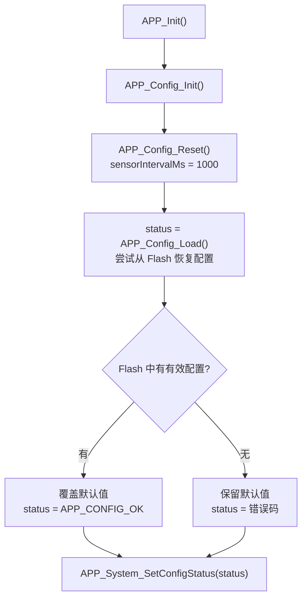
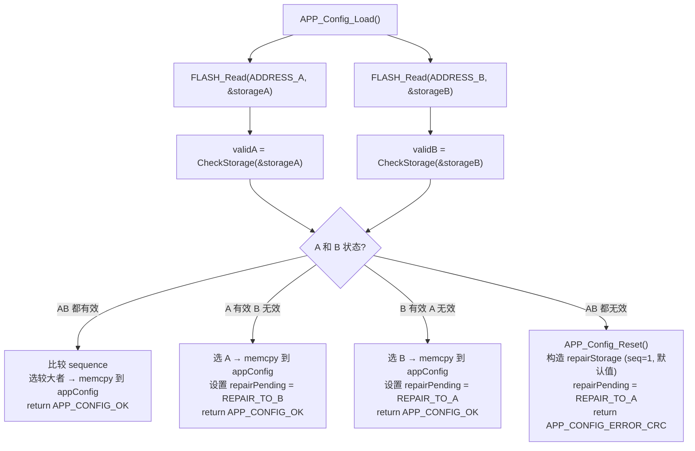
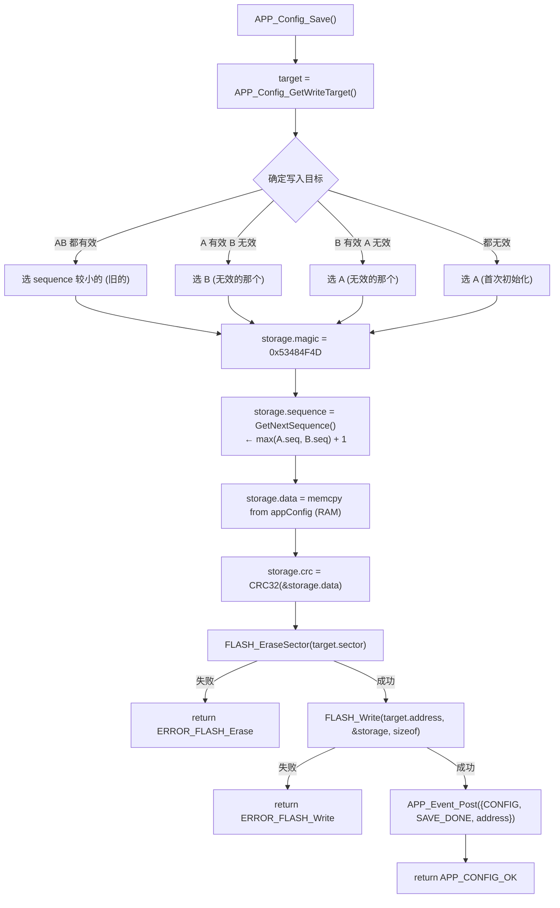
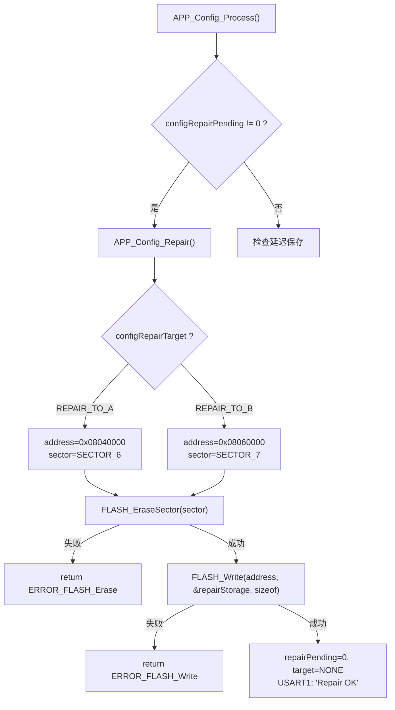

# APP_Config 配置管理模块总结

> **项目**: STM32F407 智能家居 | **版本**: v0.3 | **日期**: 2026-08-02
> **涉及文件**: `APP/app_config.c`、`APP/app_config.h`、`APP/app_status.h`、`APP/app_event.h`

---

# 一、模块简介

APP_Config 是智能家居系统中的**配置管理模块**，负责系统运行参数的持久化存储与恢复。

**主要负责：**

- 系统参数保存（`sensorIntervalMs` 传感器采样间隔）
- Flash 配置读取（双备份对比，Sequence 选最新）
- Flash 配置写入（选择目标 Sector → Erase → Write）
- 五重有效性检查（Magic → Version → Length → Value Range → CRC32）
- 双区域备份（Sector6 = A, Sector7 = B）
- 配置异常恢复（单备份有效时后台修复另一备份）
- 延迟保存（30 秒防抖，减少 Flash 擦写次数）
- 配置变化事件通知（`APP_CONFIG_EVENT_CHANGED` / `SAVE_DONE`）

**当前管理参数：**

```c
// [APP/app_config.h:30-34]
typedef struct
{
    uint32_t sensorIntervalMs;   // 传感器采样间隔 (ms)
                                 // 默认: 1000ms
                                 // 合法范围: [500, 60000]
} APP_ConfigData_t;
```

---

# 二、软件结构

## 2.1 文件组织

```
APP/
├── app_config.c           # 配置管理实现（Init / Load / Save / Process / Repair / PrintInfo）
├── app_config.h           # 配置管理头文件（结构体 / 宏 / 接口声明）
├── app_status.h           # 配置状态码枚举（APP_ConfigStatus_t, 8 种状态）
└── app_event.h            # 事件系统（Config 事件 ID 定义）

Hardware/
└── flash.c/h              # Flash 底层驱动（Erase / Write / Read）
```

## 2.2 依赖关系

```
app_config.c
    │
    ├── flash.h              → FLASH_Read / FLASH_Write / FLASH_EraseSector
    ├── app_status.h         → APP_ConfigStatus_t 枚举
    ├── app_system.h         → APP_System_SetConfigStatus / GetConfigStatus
    ├── app_event.h          → APP_Event_Post({CONFIG, CHANGED / SAVE_DONE})
    ├── usart.h / usart_driver.h → USART_Printf (调试打印)
    └── string.h             → memcpy / memcmp / memset
```

---

# 三、Flash 存储布局

```c
// [APP/app_config.h:7-9]
#define APP_CONFIG_FLASH_ADDRESS  0x08060000    // (历史遗留，未使用)
#define APP_CONFIG_MAGIC          0x53484F4D    // 魔数 "SHOM"
#define APP_CONFIG_VERSION        0x0002        // 当前配置版本
```

```
┌──────────────────────────────────────┐
│  Sector 6 (0x08040000, 128KB)        │
│  ┌────────────────────────────────┐  │
│  │  Config A (备份 A)              │  │
│  │  magic      : 0x53484F4D       │  │
│  │  version    : 0x0002           │  │
│  │  length     : sizeof(Data)     │  │
│  │  sequence   : 单调递增序号      │  │
│  │  data       : sensorIntervalMs │  │
│  │  crc        : CRC32(data)      │  │
│  └────────────────────────────────┘  │
├──────────────────────────────────────┤
│  Sector 7 (0x08060000, 128KB)        │
│  ┌────────────────────────────────┐  │
│  │  Config B (备份 B)              │  │
│  │  结构同上                       │  │
│  └────────────────────────────────┘  │
└──────────────────────────────────────┘
```

```c
// [APP/app_config.h:36-51]
typedef struct
{
    uint32_t magic;              // 魔数: 0x53484F4D
    uint16_t version;            // 版本: 0x0002
    uint16_t length;             // sizeof(APP_ConfigData_t)
    uint32_t sequence;           // 单调递增版本号（用于双备份选最新）
    APP_ConfigData_t data;       // 配置数据体
    uint32_t crc;                // data 字段的 CRC32
} APP_ConfigStorage_t;
```

**关键宏定义：**

```c
#define APP_CONFIG_DEFAULT_INTERVAL   1000    // 默认采样间隔 1s
#define APP_CONFIG_MIN_INTERVAL_MS    500U    // 最小采样间隔 500ms
#define APP_CONFIG_MAX_INTERVAL_MS    60000U  // 最大采样间隔 60s
#define APP_CONFIG_SAVE_DELAY_MS      30000U  // 延迟保存时间 30s
#define APP_CONFIG_INITIAL_SEQUENCE   1U      // 首次初始化 Sequence 起始值
```

---

# 四、配置状态码

```c
// [APP/app_status.h:5-25]
typedef enum
{
    APP_CONFIG_OK = 0,                // 操作成功
    APP_CONFIG_ERROR_MAGIC,           // Magic 号不匹配
    APP_CONFIG_ERROR_VERSION,         // 版本号不匹配
    APP_CONFIG_ERROR_LENGTH,          // 数据长度不匹配
    APP_CONFIG_ERROR_CRC,             // CRC32 校验失败
    APP_CONFIG_ERROR_VALUE,           // 参数值超出合法范围
    APP_CONFIG_ERROR_FLASH_Erase,     // Flash 扇区擦除失败
    APP_CONFIG_ERROR_FLASH_Write      // Flash 写入失败
} APP_ConfigStatus_t;
```

---

# 五、初始化流程

```c
// [APP/app_config.c:47-70]
void APP_Config_Init(void)
{
    APP_ConfigStatus_t status;

    APP_Config_Reset();                        // ① 先加载默认值
    status = APP_Config_Load();                // ② 尝试从 Flash 恢复
    APP_System_SetConfigStatus(status);        // ③ 同步状态到系统

    USART_Printf(&huart1, "Config status=%d\r\n", status);
}
```



---

# 六、配置加载流程

```c
// [APP/app_config.c:148-310]
APP_ConfigStatus_t APP_Config_Load(void);
```



**双备份恢复决策表：**

| A 状态 | B 状态 | 决策 | 修复目标 |
|--------|--------|------|---------|
| 有效 | 有效 | 选 `sequence` 较大者 | 无需修复 |
| 有效 | 无效 | 加载 A | 后台修复 B |
| 无效 | 有效 | 加载 B | 后台修复 A |
| 无效 | 无效 | 使用默认值 | 后台初始化修复 A |

---

# 七、配置有效性检查

```c
// [APP/app_config.c:82-143]
static uint8_t APP_Config_CheckStorage(APP_ConfigStorage_t *storage)
{
    if (storage == NULL)                                return 0;

    // ① Magic 检查
    if (storage->magic != APP_CONFIG_MAGIC)             return 0;

    // ② Version 检查
    if (storage->version != APP_CONFIG_VERSION)         return 0;

    // ③ Length 检查
    if (storage->length != sizeof(APP_ConfigData_t))    return 0;

    // ④ 参数范围检查
    if (!APP_Config_Check(&storage->data))              return 0;

    // ⑤ CRC32 校验
    uint32_t crc = APP_Config_CRC32((uint8_t*)&storage->data,
                                     sizeof(APP_ConfigData_t));
    if (crc != storage->crc)                            return 0;

    return 1;   // 全部通过
}
```

**参数范围检查：**

```c
// [APP/app_config.c:492-523]
static uint8_t APP_Config_Check(APP_ConfigData_t *config)
{
    if (config == NULL)                                         return 0;
    if (config->sensorIntervalMs < APP_CONFIG_MIN_INTERVAL_MS)  return 0;
    if (config->sensorIntervalMs > APP_CONFIG_MAX_INTERVAL_MS)  return 0;
    return 1;
}
```

**CRC32 计算**（多项式 `0xEDB88320`）：

```c
static uint32_t APP_Config_CRC32(const uint8_t *data, uint32_t length)
{
    uint32_t crc = 0xFFFFFFFF;
    while (length--) {
        crc ^= *data++;
        for (uint8_t i = 0; i < 8; i++)
            crc = (crc & 1) ? (crc >> 1) ^ 0xEDB88320 : crc >> 1;
    }
    return crc ^ 0xFFFFFFFF;
}
```

---

# 八、配置保存流程

```c
// [APP/app_config.c:315-404]
APP_ConfigStatus_t APP_Config_Save(void);
```



**写入目标选择逻辑：**

```c
// [APP/app_config.c:586-702]
static APP_ConfigTarget_t APP_Config_GetWriteTarget(void)
{
    // 原则：优先写入"旧"的或"无效"的备份，保护最新的有效数据
}
```

---

# 九、Sequence 版本管理

```c
// [APP/app_config.c:530-584]
static uint32_t APP_Config_GetNextSequence(void)
{
    uint32_t maxSequence = 0;

    // 读取 A 的 sequence
    FLASH_Read(ADDRESS_A, &storageA, sizeof);
    if (CheckStorage(&storageA) && storageA.sequence > maxSequence)
        maxSequence = storageA.sequence;

    // 读取 B 的 sequence
    FLASH_Read(ADDRESS_B, &storageB, sizeof);
    if (CheckStorage(&storageB) && storageB.sequence > maxSequence)
        maxSequence = storageB.sequence;

    return maxSequence + 1;   // 每次保存递增
}
```

**示例：**

```
初始状态:  A(无效), B(无效)     → 首次保存: seq = 1
第一次修改: A(seq=1), B(无效)    → 写入 B:    seq = 2
第二次修改: A(seq=1), B(seq=2)  → 写入 A:    seq = 3
掉电后:    A(seq=3), B(seq=2)  → 加载 A (序列号更大)
```

---

# 十、自动修复机制

```c
// [APP/app_config.c:704-771]
static APP_ConfigStatus_t APP_Config_Repair(void);
```

**触发条件**：`APP_Config_Load()` 检测到只有一个备份有效，或两个都无效时，设置 `configRepairPending` 和 `configRepairTarget`。



---

# 十一、延迟保存机制

**设计目的**：减少 Flash 擦写次数（Flash 寿命约 10,000 次擦写）。

```c
// [APP/app_config.c:410-447]
void APP_Config_SetSensorInterval(uint32_t ms)
{
    if (ms < APP_CONFIG_MIN_INTERVAL_MS)
        ms = APP_CONFIG_MIN_INTERVAL_MS;

    if (appConfig.sensorIntervalMs != ms)
    {
        appConfig.sensorIntervalMs = ms;       // ① 仅修改 RAM
        configDirty = 1;                        // ② 标记脏数据
        configDirtyTick = HAL_GetTick();        // ③ 记录修改时间

        APP_Event_Post({CONFIG, CHANGED, ms});  // ④ 发送变更事件
    }
}
```

**后台处理**（`APP_Config_Process` 在主循环中调用）：

```c
// [APP/app_config.c:778-816]
void APP_Config_Process(void)
{
    // 优先处理修复
    if (configRepairPending) { APP_Config_Repair(); return; }

    // 延迟保存：修改后 30 秒才写入 Flash
    if (configDirty)
    {
        if (HAL_GetTick() - configDirtyTick >= APP_CONFIG_SAVE_DELAY_MS)
        {
            if (APP_Config_Save() == APP_CONFIG_OK)
            {
                configDirty = 0;               // 保存成功，清除脏标志
                USART_Printf(&huart1, "Config Saved\r\n");
            }
        }
    }
}
```

**延迟时间**：`APP_CONFIG_SAVE_DELAY_MS = 30000`（30 秒）。在 30 秒内多次修改参数只触发一次 Flash 写入。

---

# 十二、Event 事件通知

| 触发条件 | event.type | event.id | event.param | 消费者动作 |
|---------|-----------|----------|-------------|-----------|
| `SetSensorInterval()` 修改参数 | `APP_EVENT_CONFIG` | `APP_CONFIG_EVENT_CHANGED` | 新间隔值 (ms) | `APP_Timer_SetInterval(SENSOR, param)` |
| `APP_Config_Save()` 写入完成 | `APP_EVENT_CONFIG` | `APP_CONFIG_EVENT_SAVE_DONE` | 写入地址 | `USART_Printf` 调试日志 |

---

# 十三、调试信息输出

```c
// [APP/app_config.c:822-930]
void APP_Config_PrintInfo(void);
```

通过 USART1 输出双备份完整状态：

```
========== CONFIG ==========
FLASH A:
valid=1 seq=22 interval=2000 crc=0xABCD1234
FLASH B:
valid=1 seq=21 interval=1000 crc=0x1234ABCD
RAM:
interval=2000 ms
RepairPending=0 Target=0
============================
```

**调用方式**：蓝牙 `CONFIG` 命令 → `APP_Cmd_Config()` → `APP_Config_PrintInfo()`。

---

# 十四、接口总结

**公开接口：**

| 函数 | 返回值 | 作用 | 调用者 |
|------|--------|------|--------|
| `APP_Config_Init()` | `void` | 默认值 → Flash 恢复 → 同步状态 | `APP_Init()` |
| `APP_Config_Reset()` | `void` | 恢复默认参数 | `APP_Config_Init()` / Load 失败时 |
| `APP_Config_Load()` | `APP_ConfigStatus_t` | 从 Flash 双备份恢复配置 | `APP_Config_Init()` |
| `APP_Config_Save()` | `APP_ConfigStatus_t` | 擦除 → 写入 Flash | `APP_Config_Process()` / `Repair()` |
| `APP_Config_Process()` | `void` | 后台任务：修复 + 延迟保存 | `APP_Run()` 主循环 |
| `APP_Config_SetSensorInterval(ms)` | `void` | 修改采样间隔 + 置 Dirty + 发 Event | `APP_Protocol` (INTERVAL 命令) |
| `APP_Config_GetSensorInterval()` | `uint32_t` | 读取当前采样间隔 | `APP_Run()` / `APP_Protocol` / `APP_Display` |
| `APP_Config_IsDirty()` | `uint8_t` | 查询是否有未保存修改 | 外部查询 |
| `APP_Config_PrintInfo()` | `void` | 打印双备份完整状态 | `APP_Protocol` (CONFIG 命令) |

**内部静态函数：**

| 函数 | 作用 |
|------|------|
| `APP_Config_CRC32(data, len)` | 软件 CRC32 计算 |
| `APP_Config_Check(config)` | 参数范围校验 (500~60000ms) |
| `APP_Config_CheckStorage(storage)` | 五重校验（Magic/Version/Length/Value/CRC） |
| `APP_Config_GetNextSequence()` | max(A.seq, B.seq) + 1 |
| `APP_Config_GetWriteTarget()` | 确定写入目标（保护最新有效数据） |
| `APP_Config_Repair()` | 修复损坏的备份 |

---

# 十五、容易出错的问题

## 1. Sector 选择错误

STM32F407VET6 仅 512KB Flash（Sector 0~7）。`FLASH_EraseSector()` 中已加入安全保护，只允许 Sector 6 和 Sector 7。

## 2. Flash 不可覆盖写

修改数据必须先 `Erase` 整个 Sector（128KB），再 `Write` 新数据。当前 `Save()` / `Repair()` 严格遵循 Erase→Write 流程。

## 3. Flash 操作耗时

Sector 擦除约 1~2 秒，期间 Flash 总线停滞。**绝不能**在 ISR 中执行。当前通过 `APP_Config_Process()` 在主循环中后台执行。

## 4. CRC 校验失败

可能原因：Flash 写入中途掉电、Sector 擦除不完整。双备份机制保证至少一个有效配置可用，且后台自动修复损坏的备份。

## 5. 延迟保存丢失

如果修改参数后 30 秒内断电，修改不会写入 Flash。下次上电后恢复为上次保存的值（而非最新修改的值）。这是设计上的权衡——减少擦写次数 vs 数据实时性。

---

# 十六、FreeRTOS 迁移注意事项

**当前架构：**

```
APP_Run() 主循环
    │
    └─ APP_Config_Process()
         ├─ APP_Config_Repair()     (阻塞 1~2s)
         └─ APP_Config_Save()       (阻塞 1~2s)
```

**迁移后：**

```c
void ConfigTask(void *arg)
{
    while (1)
    {
        // 等待保存请求 (Queue) 或修复请求 (Event)
        xQueueReceive(configQueue, &request, portMAX_DELAY);

        APP_Config_Save();   // 阻塞本 Task，不影响其他 Task
        // 或
        APP_Config_Repair();
    }
}
```

**迁移要点：**

| 事项 | 策略 |
|------|------|
| Flash 操作 (Erase/Write) | 阻塞操作，必须在独立 Task 中执行 |
| `configDirty` / `configDirtyTick` | 单 Task 访问，无需 Mutex |
| 延迟保存 30s 定时 | `xTimerCreate` 替代 `HAL_GetTick()` 差值比较 |
| Event 发送 | `APP_Event_Post()` → `xQueueSend()` |
| `APP_Config_PrintInfo()` | 可能从多个 Task 调用，需保护 USART1 发送 |

---

# 十七、当前模块评价

**优点：**

| 方面 | 说明 |
|------|------|
| 双备份 | 容忍单 Sector 损坏或写入中途掉电 |
| 五重校验 | Magic → Version → Length → Value → CRC 层层把关 |
| Sequence 版本 | 双备份选最新，自动解决一致性冲突 |
| 自动修复 | 后台静默恢复损坏备份，对用户透明 |
| 延迟保存 | 30 秒防抖减少 Flash 擦写次数 |
| Event 通知 | CHANGED 立即生效，SAVE_DONE 确认持久化完成 |

**不足：**

| 方面 | 说明 | 改进方向 |
|------|------|---------|
| 单参数 | 当前仅 `sensorIntervalMs` 一个参数 | 结构体预留了扩展空间 |
| 延迟保存不可取消 | Dirty 后无法主动放弃修改 | 增加 `APP_Config_Discard()` |
| 无压缩 / 加密 | Flash 中数据明文存储 | 对智能家居场景当前无需 |
| Flash 剩余空间未利用 | Sector 6/7 各 128KB，仅用几十字节 | 可存放多版本历史配置 |
