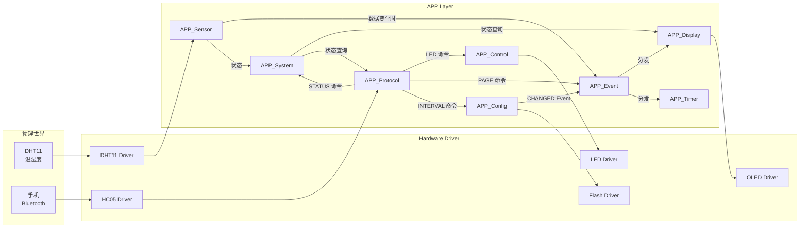
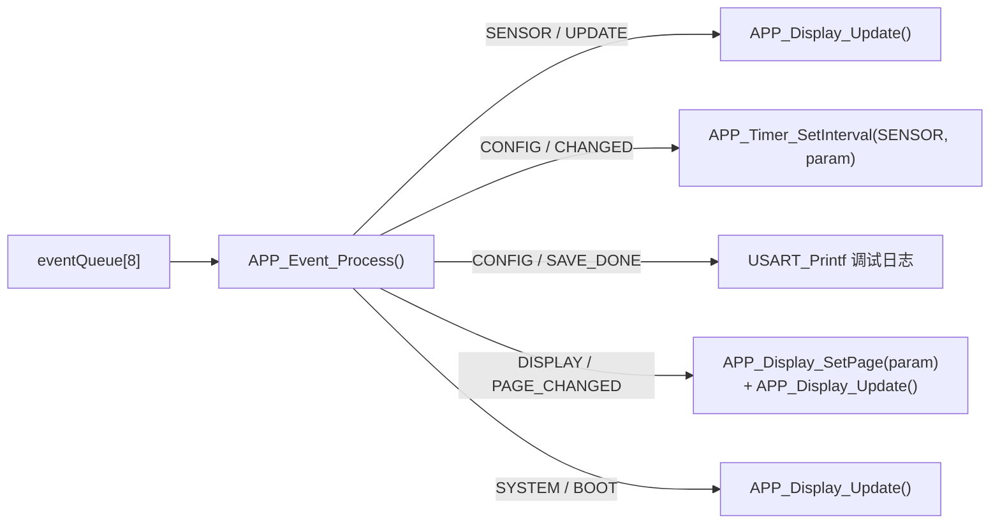
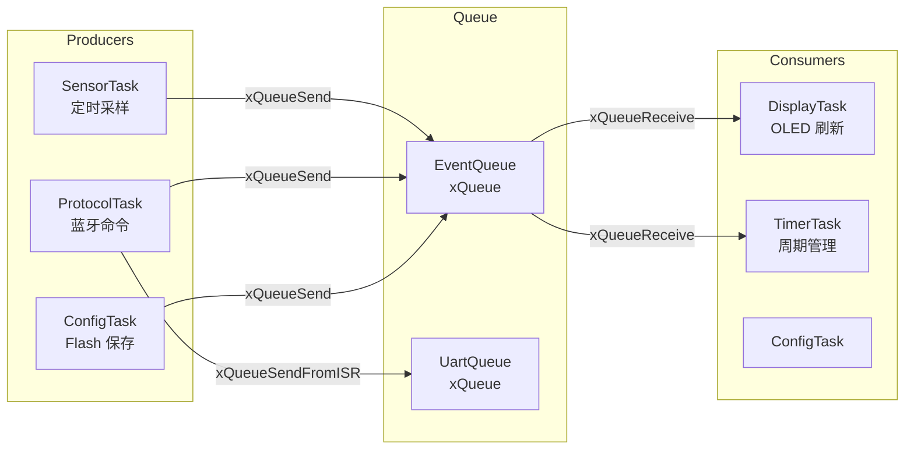

# STM32 Smart Home APP 数据流分析

> **项目**: STM32F407 智能家居 | **版本**: v0.3 | **日期**: 2026-08-02

---

## 1. 总体数据流



---

## 2. Sensor 数据流

```
┌──────────────────────────────────────────────┐
│  DHT11 硬件 (PA3)                             │
│  温湿度: 25.3°C / 68.5%                       │
└──────────────────┬───────────────────────────┘
                   │ 单总线 40bit 数据
                   ▼
┌──────────────────────────────────────────────┐
│  DHT11 Driver (Hardware/dht11.c)             │
│  DHT11_Read(&sensorData)                      │
│  → DHT11_Data_t {temp=25, temp_dec=3,        │
│                   humi=68, humi_dec=5}        │
└──────────────────┬───────────────────────────┘
                   │
                   ▼
┌──────────────────────────────────────────────┐
│  APP_Sensor (APP/app_sensor.c)               │
│  APP_Sensor_Update()                          │
│                                               │
│  ① 更新 sensorData (最新原始值)                │
│  ② APP_System_SetDHTStatus(HAL_OK)            │
│  ③ APP_System_SetSensorReady(1)               │
│  ④ memcmp(sensorData, lastSensorData)          │
│     → 有变化?                                  │
│  ⑤ APP_Event_Post({SENSOR, UPDATE})            │
│  ⑥ memcpy(&lastSensorData, &sensorData)       │
└──────────────────┬───────────────────────────┘
                   │ APP_EVENT_SENSOR / UPDATE
                   ▼
┌──────────────────────────────────────────────┐
│  APP_Event 队列                                │
│  eventQueue[]: {type=SENSOR, id=UPDATE}       │
└──────────────────┬───────────────────────────┘
                   │ APP_Event_Get()
                   ▼
┌──────────────────────────────────────────────┐
│  APP_Event_Process                            │
│  case APP_EVENT_SENSOR:                       │
│      APP_Display_Update()                     │
└──────────────────┬───────────────────────────┘
                   │
                   ▼
┌──────────────────────────────────────────────┐
│  APP_Display                                   │
│  APP_Sensor_GetData() → 获取温湿度             │
│  OLED_Printf("Temp:%d.%d C", 25, 3)           │
│  OLED_Printf("Humi:%d.%d %%", 68, 5)          │
│  OLED_Refresh() → I2C1 → SSD1306              │
└──────────────────────────────────────────────┘
```

**数据缓存**：

| 变量 | 作用 | 更新时机 |
|------|------|---------|
| `sensorData` | 当前最新采样值 | 每次 `DHT11_Read` |
| `lastSensorData` | 上次发送 Event 时的快照 | 发送 Event 后 `memcpy` |

---

## 3. HC-05 命令数据流

```
┌──────────────────────────────────────────────┐
│  手机 Bluetooth Terminal                      │
│  输入: PAGE DEBUG\r                           │
└──────────────────┬───────────────────────────┘
                   │ Bluetooth SPP
                   ▼
┌──────────────────────────────────────────────┐
│  HC-05 模块 (透传)                             │
└──────────────────┬───────────────────────────┘
                   │ UART: 'P','A','G','E',' ','D','E','B','U','G','\r'
                   ▼
┌──────────────────────────────────────────────┐
│  USART3 (PB11)                                │
│  每字节触发 USART3_IRQHandler                  │
│  → HAL_UART_IRQHandler(&huart3)               │
│  → HAL_UART_RxCpltCallback                    │
│  → HC05_BufferWrite(ch)                       │
│  → RingBuffer (128B, head/tail)               │
└──────────────────┬───────────────────────────┘
                   │ HC05_BufferRead() 轮询
                   ▼
┌──────────────────────────────────────────────┐
│  APP_Protocol_Process()                       │
│  APP_Protocol_Input() 逐字节缓存               │
│  '\r' → APP_Protocol_Parse("PAGE DEBUG")      │
│                                               │
│  strchr → cmd="PAGE", param="DEBUG"           │
│  strcmp 匹配 → APP_Cmd_Page("DEBUG")          │
└──────────────────┬───────────────────────────┘
                   │
                   ▼
            ┌──────┴──────┬──────────────┬──────────────┐
            ▼             ▼              ▼              ▼
       LED ON/OFF    PAGE HOME     INTERVAL 5      STATUS
            │             │              │              │
            ▼             ▼              ▼              ▼
    APP_Control    APP_Event      APP_Config     Sensor/System
         │             │              │           /Control/Config
         ▼             ▼              ▼              ▼
      LED_On()    Display_SetPage  Config+Event   HC05_Printf
      GPIO        Display_Update   Timer_SetInt   (逐行输出)
```

**8 条命令的数据流向：**

| 命令 | 输入 | 调用链 | 输出 |
|------|------|--------|------|
| `LED ON` | ON/OFF | Protocol → Control → LED_On/Off | `LED ON OK\r\n` |
| `OLED CLEAR` | CLEAR | Protocol → Display_Clear → OLED_Clear | `OLED CLEAR OK\r\n` |
| `TEST` | 无 | Protocol → HC05_Printf | `OK\r\n` |
| `PAGE DEBUG` | HOME/SENSOR/SYSTEM/DEBUG | Protocol → Event → Display_SetPage + Update | `PAGE DEBUG OK\r\n` |
| `INTERVAL 5` | 秒数 | Protocol → Config_SetInterval → Event → Timer_SetInterval | `INTERVAL=5 s OK\r\n` |
| `STATUS` | 无 | Protocol → 读取全部模块 → HC05_Printf × 12 | 12 行状态报告 |
| `CONFIG` | 无 | Protocol → Config_PrintInfo → USART_Printf | USART1 调试输出 |
| `OLED CLR` | 无 | Protocol → Display_Clear | `OK\r\n` |

---

## 4. Event 数据流

```c
// [APP/app_event.h:64-72]
typedef struct
{
    APP_EventType_t type;    // 事件大类 (SENSOR / CONFIG / DISPLAY / SYSTEM)
    uint16_t       id;       // 具体事件 ID
    uint32_t       param;    // 附加参数
} APP_Event_t;
```

**事件生产者：**

| 生产者 | 事件 | 触发条件 |
|--------|------|---------|
| `APP_Sensor_Update()` | `{SENSOR, UPDATE, 0}` | DHT11 数据变化 |
| `APP_Config_SetSensorInterval()` | `{CONFIG, CHANGED, new_ms}` | 参数被修改 |
| `APP_Config_Save()` | `{CONFIG, SAVE_DONE, addr}` | Flash 写入完成 |
| `APP_Cmd_Page()` | `{DISPLAY, PAGE_CHANGED, page}` | 蓝牙 PAGE 命令 |
| `APP_Init()` | `{SYSTEM, BOOT, 0}` | 系统启动完成 |

**事件消费者（`APP_Event_Process`）：**



---

## 5. Config 数据流

```
蓝牙 INTERVAL 10 命令
    │
    ▼
APP_Config_SetSensorInterval(10000)      [修改 RAM]
    │
    ├─ appConfig.sensorIntervalMs = 10000
    ├─ configDirty = 1
    ├─ configDirtyTick = HAL_GetTick()
    │
    └─ APP_Event_Post({CONFIG, CHANGED, 10000})
         │
         └─ APP_Timer_SetInterval(SENSOR, 10000)  [Timer 周期立即生效]

    ...主循环继续运行，30 秒内多次修改只保留最后一次...

APP_Config_Process()                     [每轮主循环检查]
    │
    └─ [configDirty && now - dirtyTick >= 30000]
         │
         ▼
    APP_Config_Save()
         │
         ├─ APP_Config_GetWriteTarget()
         │    → 确定写入 Sector6(A) 或 Sector7(B)
         │
         ├─ storage.sequence = GetNextSequence()
         │    → max(A.seq, B.seq) + 1
         │
         ├─ storage.magic  = 0x53484F4D
         ├─ storage.version = 0x0002
         ├─ storage.data   = appConfig (RAM)
         ├─ storage.crc    = CRC32(&storage.data)
         │
         ├─ FLASH_EraseSector(target_sector)
         ├─ FLASH_Write(target_address, &storage, sizeof)
         │
         └─ APP_Event_Post({CONFIG, SAVE_DONE, address})

    ...系统断电...

下次上电:
APP_Config_Init()
    └─ APP_Config_Load()
         ├─ FLASH_Read(Sector6, &storageA)
         ├─ FLASH_Read(Sector7, &storageB)
         ├─ CheckStorage: Magic → Version → Length → Value → CRC
         ├─ [AB 都有效] → 选 sequence 较大者
         └─ memcpy(&appConfig, &storageX.data, sizeof)
              → sensorIntervalMs = 10000  ✓ 恢复成功
```

---

## 6. Display 数据流

Display **不主动读取硬件**。所有显示数据通过 APP 接口获取：

```c
// [APP/app_display.c] 各页面函数的数据来源

// Home / Sensor 页
sensor = APP_Sensor_GetData();           // → DHT11_Data_t (温湿度)
ready  = APP_System_IsSensorReady();     // → 判断显示占位符还是真实数据

// Home / System 页
led = APP_Control_GetLEDState();         // → APP_LED_ON / APP_LED_OFF

// System 页
bt  = APP_System_GetBTStatus();          // → 0 (未就绪) / 1 (已就绪)
cfg = APP_System_GetConfigStatus();      // → APP_CONFIG_OK / ERROR_XXX

// Debug 页
tick = HAL_GetTick();                    // → 系统运行毫秒数
```

**Display 刷新触发源：**

| 触发方式 | 触发条件 | 方法 |
|---------|---------|------|
| Event: SENSOR/UPDATE | DHT11 数据变化 | `APP_Event_Process` → `APP_Display_Update()` |
| Event: SYSTEM/BOOT | 系统启动完成 | `APP_Event_Process` → `APP_Display_Update()` |
| Event: DISPLAY/PAGE_CHANGED | 蓝牙 PAGE 命令 | `APP_Event_Process` → `APP_Display_SetPage()` + `Update()` |
| 命令: OLED CLEAR | 蓝牙 OLED CLEAR 命令 | `APP_Cmd_OLED_Clear` → `APP_Display_Clear()` |

---

## 7. 数据方向总结

| 数据 | 来源 | 中间层 | 目的地 | 触发方式 |
|------|------|--------|--------|---------|
| 温湿度 | DHT11 硬件 | APP_Sensor → Event | APP_Display → OLED | Timer 周期 |
| LED 状态 | APP_Control | — | APP_Display → OLED | 页面切换时查询 |
| 蓝牙状态 | HC05_Init | APP_System | APP_Display / APP_Protocol | 页面/命令查询 |
| 配置状态 | APP_Config_Load | APP_System | APP_Display / APP_Protocol | 页面/命令查询 |
| 配置参数 | APP_Config (RAM) | Event | APP_Timer (周期) | INTERVAL 命令 |
| 蓝牙命令 | HC-05 硬件 | APP_Protocol | APP_Control / Config / Display / Event | UART 中断 |
| 系统 Tick | SysTick | HAL_GetTick | APP_Timer / APP_Display / APP_System | 持续 |

---

## 8. RTOS 迁移影响

**当前数据流（裸机、单线程）：**

```
Sensor Update → Event Queue → Display Update
     (全部在主循环中顺序执行，无竞争)
```

**迁移后数据流（RTOS、多线程）：**

```
SensorTask ──Queue──▶ DisplayTask
    │                     │
    └── 写 sensorData      └── 读 sensorData  ← 需要 Mutex 保护!
```

**关键数据同步点：**

| 共享数据 | 写入者 | 读取者 | RTOS 保护方案 |
|---------|--------|--------|-------------|
| `sensorData` | SensorTask | DisplayTask | Mutex 或 双缓冲 |
| `appConfig` | ConfigTask | DisplayTask / TimerTask | Mutex |
| `eventQueue` | 多个 Producer | EventTask | 直接替换为 FreeRTOS Queue |
| `timerTable` | TimerTask | TimerTask | 单 Task 访问，无需保护 |
| `HC05_RxBuffer` | USART3 ISR | ProtocolTask | 替换为 `xQueueSendFromISR` |

**迁移后的 Task 间数据流：**



> **核心优势**：当前裸机 `APP_Event` 的设计（FIFO 队列 + Producer/Consumer 模式）与 FreeRTOS Queue 语义高度一致，迁移时仅需替换底层 API，上层事件类型和分发逻辑**完全不变**。
