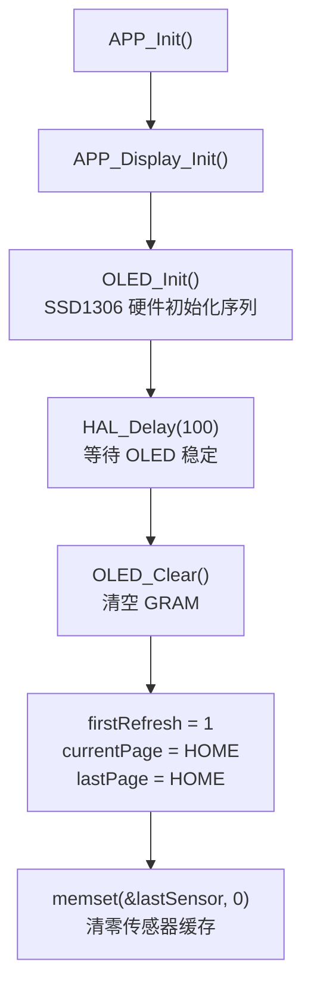
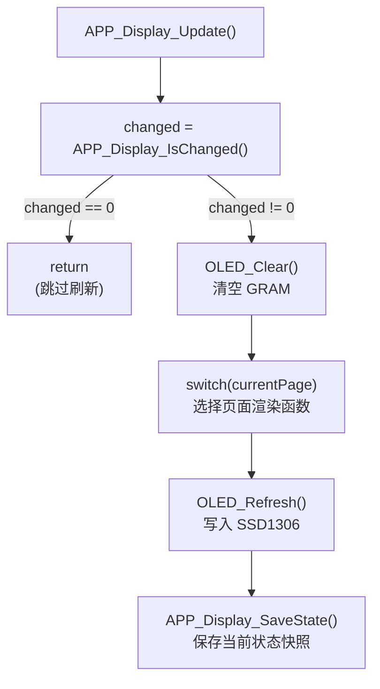

# APP_Display 显示应用模块总结

> **项目**: STM32F407 智能家居 | **版本**: v0.3 | **日期**: 2026-08-02
> **涉及文件**: `APP/app_display.c`、`APP/app_display.h`

---

## 1. 模块简介

APP_Display 是智能家居系统中的**应用层显示管理模块**。

**主要负责：**

- OLED 初始化
- 显示页面管理（HOME / SENSOR / SYSTEM / CONFIG(预留) / DEBUG）
- 传感器温湿度数据显示
- 系统状态显示（LED / HC-05 / Flash 配置）
- 显示变化检测（Dirty Check）
- OLED 刷新控制

**职责边界：**

```
┌─────────────────────────────────────┐
│           APP_Display               │
│  决定显示什么内容、判断何时刷新        │
└──────────────┬──────────────────────┘
               │
               ▼
┌─────────────────────────────────────┐
│          OLED Driver (oled.c)       │
│  负责 I2C 通信、显存管理、字符绘制    │
└──────────────┬──────────────────────┘
               │
               ▼
┌─────────────────────────────────────┐
│         SSD1306 OLED (硬件)          │
└─────────────────────────────────────┘
```

**数据来源：**

```
              APP_Display
                  │
    ┌─────────────┼─────────────┐
    │             │             │
    ▼             ▼             ▼
APP_Sensor    APP_System    APP_Control
(温湿度)      (HC05/CFG)     (LED 状态)
    │             │             │
    ▼             ▼             ▼
OLED Driver → SSD1306 OLED
```

---

## 2. 文件结构

```
APP/
├── app_display.c          # 显示管理实现（5 个公开接口 + 5 个静态页面函数）
└── app_display.h          # 显示管理头文件（页面枚举 + 接口声明）
```

**依赖模块：**

```
app_display.c
    │
    ├── app_sensor.h       → APP_Sensor_GetData()         获取温湿度数据
    ├── app_control.h      → APP_Control_GetLEDState()    获取 LED 状态
    ├── app_system.h       → APP_System_GetBTStatus()     获取蓝牙状态
    │                      → APP_System_GetConfigStatus()  获取配置状态
    │                      → APP_System_IsSensorReady()    判断传感器就绪
    ├── app_status.h       → APP_CONFIG_OK                判断配置状态值
    ├── oled.h             → OLED_Init / OLED_Clear / ...  底层显示驱动
    ├── usart.h            → &huart1                      调试输出 (已注释)
    └── usart_driver.h     → USART_Printf()               调试输出 (已注释)
```

---

## 3. 显示状态缓存设计

APP_Display 内部保存**上一轮显示状态**，用于判断是否需要刷新 OLED。每次刷新后调用 `APP_Display_SaveState()` 更新缓存。

### 3.1 传感器缓存

```c
// [APP/app_display.c:13]
static DHT11_Data_t lastSensor;
```

保存上一次显示时的温湿度数据。与 `APP_Sensor_GetData()` 返回的当前值比对，判断数据是否变化。

### 3.2 LED 状态缓存

```c
// [APP/app_display.c:15]
static APP_LED_State_t lastLedState = APP_LED_OFF;
```

保存上一次显示时的 LED 状态，初始值为 `APP_LED_OFF`。

### 3.3 首次刷新标志

```c
// [APP/app_display.c:18]
static uint8_t firstRefresh = 1;
```

系统首次启动时强制刷新一次 OLED，刷新后置为 `0`。

```
系统启动 → firstRefresh = 1 → 强制刷新 → firstRefresh = 0 → 之后按需刷新
```

### 3.4 页面缓存

```c
// [APP/app_display.c:20-22]
static APP_DisplayPage_t currentPage = DISPLAY_PAGE_HOME;  // 当前页
static APP_DisplayPage_t lastPage    = DISPLAY_PAGE_HOME;  // 上一页
```

检测页面切换：`currentPage != lastPage` 时强制刷新。

---

## 4. 初始化流程

```c
// [APP/app_display.c:27-45]
void APP_Display_Init(void)
{
    OLED_Init();                                    // ① SSD1306 硬件初始化 (I2C 命令序列)
    HAL_Delay(100);                                 // ② 等待 OLED 稳定

    OLED_Clear();                                   // ③ 清空 GRAM

    firstRefresh = 1;                               // ④ 标记首次刷新
    currentPage  = DISPLAY_PAGE_HOME;               // ⑤ 默认首页
    lastPage     = DISPLAY_PAGE_HOME;               // ⑥ 缓存上一页为首页

    memset(&lastSensor, 0, sizeof(lastSensor));     // ⑦ 清零传感器缓存
}
```



> **注意**：`APP_Display_Init()` 中不再调用 `OLED_ShowString(" Smart Home")` 和 `OLED_Refresh()`——首次显示由主循环中 `APP_Event_Process()` 处理 BOOT 事件时触发 `APP_Display_Update()` 完成。

---

## 5. 页面管理

### 5.1 页面枚举

```c
// [APP/app_display.h:10-24]
typedef enum
{
    DISPLAY_PAGE_HOME   = 0,   // 主页：温湿度 + LED 状态
    DISPLAY_PAGE_SENSOR,       // 传感器页：仅温湿度
    DISPLAY_PAGE_SYSTEM,       // 系统状态页：LED / HC05 / CFG
    DISPLAY_PAGE_CONFIG,       // 配置页（已定义，未实现）
    DISPLAY_PAGE_DEBUG,        // 调试页：Tick / 模式
    DISPLAY_PAGE_MAX           // 哨兵值
} APP_DisplayPage_t;
```

| 页面 | 枚举值 | 状态 | 显示内容 |
|------|--------|------|---------|
| `DISPLAY_PAGE_HOME` | 0 | ✅ 已实现 | 温湿度 + LED 状态（含 SensorReady 占位） |
| `DISPLAY_PAGE_SENSOR` | 1 | ✅ 已实现 | 仅温湿度 |
| `DISPLAY_PAGE_SYSTEM` | 2 | ✅ 已实现 | LED / HC05 / CFG 状态 |
| `DISPLAY_PAGE_CONFIG` | 3 | ⚠️ 已定义未实现 | `APP_Display_Update()` 中 case 被注释 |
| `DISPLAY_PAGE_DEBUG` | 4 | ✅ 已实现 | 系统 Tick / 运行模式 |

### 5.2 页面切换接口

```c
// [APP/app_display.c:281-292]
void APP_Display_SetPage(APP_DisplayPage_t page)
{
    if (page >= DISPLAY_PAGE_MAX)      // 边界检查
        return;

    if (currentPage != page)           // 仅在真正变化时才设置
        currentPage = page;
}
```

**调用流程：**

```
蓝牙 PAGE 命令 → APP_Event (DISPLAY/PAGE_CHANGED) → APP_Event_Process()
    → APP_Display_SetPage(param) → currentPage 改变
    → 下次 APP_Display_Update() 检测到页面变化 → 刷新 OLED
```

### 5.3 获取当前页面

```c
// [APP/app_display.c:301-304]
APP_DisplayPage_t APP_Display_GetPage(void)
{
    return currentPage;
}
```

---

## 6. 显示变化检测机制（Dirty Check）

核心函数：

```c
// [APP/app_display.c:54-87]
static uint8_t APP_Display_IsChanged(void)
```

**返回值：**

| 返回值 | 含义 |
|--------|------|
| `1` | 数据发生变化，需要刷新 OLED |
| `0` | 数据无变化，跳过刷新 |

**五个判断条件：**

```c
static uint8_t APP_Display_IsChanged(void)
{
    const DHT11_Data_t *sensor = APP_Sensor_GetData();

    // ① 首次刷新：系统启动后必须刷新一次
    if (firstRefresh)
        return 1;

    // ② 页面切换：用户切换了显示页面
    if (currentPage != lastPage)
        return 1;

    // ③ 温度变化
    if (sensor->temperature != lastSensor.temperature)
        return 1;

    // ④ 湿度变化
    if (sensor->humidity != lastSensor.humidity)
        return 1;

    // ⑤ LED 状态变化
    if (APP_Control_GetLEDState() != lastLedState)
        return 1;

    return 0;   // 无变化
}
```

> **注意**：HC-05 状态和 Config 状态的变化**不触发刷新检测**——它们只在用户主动切换到 SYSTEM 页面时通过页面切换条件触发刷新。如果 SYSTEM 页面一直显示而 HC05/Config 状态变化，当前不会自动刷新。

---

## 7. Dirty Check 刷新机制



**优点：**

- 减少 I2C 通信次数（仅在数据变化时才传输 1KB+ 数据）
- 降低 CPU 占用（大部分循环中 `IsChanged()` 返回 0，直接 return）
- 避免 OLED 无意义重复刷新（延长屏幕寿命）

---

## 8. 显示刷新流程

```c
// [APP/app_display.c:214-279]
void APP_Display_Update(void)
{
    uint8_t changed;

    changed = APP_Display_IsChanged();       // ① 检测是否有变化
    if (changed == 0) return;                // ② 无变化直接返回

    OLED_Clear();                            // ③ 清空 GRAM

    switch (currentPage)                     // ④ 按页面渲染
    {
        case DISPLAY_PAGE_HOME:    APP_Display_ShowHomePage();    break;
        case DISPLAY_PAGE_SENSOR:  APP_Display_ShowSensorPage();  break;
        case DISPLAY_PAGE_SYSTEM:  APP_Display_ShowSystemPage();  break;
        // case DISPLAY_PAGE_CONFIG: 已注释，未实现
        case DISPLAY_PAGE_DEBUG:   APP_Display_ShowDebugPage();   break;
        default: break;
    }

    OLED_Refresh();                          // ⑤ 将 GRAM 写入 SSD1306
    APP_Display_SaveState();                 // ⑥ 保存当前状态快照
}
```

**主循环调用：** `APP_Display_Update()` 在两种情况下被调用：

1. **主循环轮询**：`APP_Run()` 中无直接调用——当前版本已将 Display 刷新完全交给 Event 系统
2. **事件驱动**：`APP_Event_Process()` 在处理 SENSOR/UPDATE、SYSTEM/BOOT、DISPLAY/PAGE_CHANGED 事件时调用

---

## 9. 页面显示函数

### 9.1 Home 页面

```c
// [APP/app_display.c:108-140]
static void APP_Display_ShowHomePage(void)
```

**显示布局：**

```
Smart Home                     ← 第 0 行
Temp: 25.3 C                   ← 第 16 像素 (或 --.- C 占位)
Humi: 68.5 %                   ← 第 32 像素 (或 --.- % 占位)
LED : ON                       ← 第 48 像素
```

**数据来源：**

| 显示项 | 数据来源 | 条件 |
|--------|---------|------|
| 温度 | `APP_Sensor_GetData()->temperature / temperature_dec` | `APP_System_IsSensorReady()` 为真时 |
| 温度占位 | `"Temp:--.- C"` | `APP_System_IsSensorReady()` 为假时 |
| 湿度 | `APP_Sensor_GetData()->humidity / humidity_dec` | `APP_System_IsSensorReady()` 为真时 |
| 湿度占位 | `"Humi:--.- %"` | `APP_System_IsSensorReady()` 为假时 |
| LED 状态 | `APP_Control_GetLEDState()` | 始终显示 (ON/OFF) |

> **SensorReady 检查**：Home 页面是唯一使用 `APP_System_IsSensorReady()` 的页面——当传感器尚未完成首次采样时，显示 `--.-` 占位符而非无效数据。

### 9.2 Sensor 页面

```c
// [APP/app_display.c:142-163]
static void APP_Display_ShowSensorPage(void)
```

**显示布局：**

```
Sensor
Temp: 25.3 C
Humi: 68.5 %
```

> **注意**：Sensor 页面**没有** SensorReady 检查——它直接显示 `APP_Sensor_GetData()` 的当前值，在传感器未就绪时可能显示全零数据。

### 9.3 System 页面

```c
// [APP/app_display.c:165-192]
static void APP_Display_ShowSystemPage(void)
```

**显示布局：**

```
System
LED : ON
HC05: OK
CFG: OK
```

**状态来源：**

| 显示项 | 数据来源 | OK/ERR 判断逻辑 |
|--------|---------|---------------|
| LED | `APP_Control_GetLEDState()` | `== APP_LED_ON ? "ON" : "OFF"` |
| HC05 | `APP_System_GetBTStatus()` | `? "OK" : "ERR"` |
| CFG | `APP_System_GetConfigStatus()` | `== APP_CONFIG_OK ? "OK" : "ERR"` |

> **注意**：第 4 行 `"Mode: Bare"` 已被注释（[app_display.c:189-191](APP/app_display.c#L189)），当前 System 页面仅显示 3 行状态。

### 9.4 Debug 页面

```c
// [APP/app_display.c:194-210]
static void APP_Display_ShowDebugPage(void)
```

**显示布局：**

```
Debug
Tick: 1234567
Mode: Bare
Ready
```

用于系统调试，显示 `HAL_GetTick()` 原始值。

---

## 10. 显示状态保存

```c
// [APP/app_display.c:92-105]
static void APP_Display_SaveState(void)
{
    const DHT11_Data_t *sensor = APP_Sensor_GetData();

    lastSensor   = *sensor;                          // 保存当前传感器数据
    lastLedState = APP_Control_GetLEDState();         // 保存当前 LED 状态
    lastPage     = currentPage;                       // 保存当前页面
    firstRefresh = 0;                                 // 清除首次刷新标志
}
```

每次 `APP_Display_Update()` 完成刷新后调用，将**当前显示的数据**保存为下一轮的比较基准。

---

## 11. 清屏接口

```c
// [APP/app_display.c:294-299]
void APP_Display_Clear(void)
{
    OLED_Clear();       // 清空 GRAM
    OLED_Refresh();     // 立即写入 SSD1306
}
```

由蓝牙 `OLED CLEAR` 命令触发。

---

## 12. 模块优点

### 分层明确

```
OLED Driver (oled.c)         →  负责硬件：I2C 通信 / 显存 / 字符绘制
APP_Display (app_display.c)  →  负责业务：页面管理 / 变化检测 / 数据聚合
```

两层各司其职，修改显示逻辑不需要触碰 I2C 驱动代码。

### 降低刷新压力

Dirty Check 机制确保仅在数据真正变化时才触发 I2C 传输（每次约 1KB），大幅减少：
- I2C 总线占用
- CPU 等待时间（I2C 100kHz 下传输 1KB 约需 80ms）

### 模块低耦合

APP_Display 不直接访问任何底层硬件或模块内部变量，全部通过标准接口获取数据：

```c
APP_Sensor_GetData()           // 传感器数据
APP_Control_GetLEDState()      // LED 状态
APP_System_GetBTStatus()       // 蓝牙状态
APP_System_GetConfigStatus()   // 配置状态
APP_System_IsSensorReady()     // 传感器就绪标志
```

---

## 13. 当前不足

### 13.1 OLED 刷新为阻塞操作

当前 `OLED_Refresh()` → `OLED_Update()` 内部逐页调用 `HAL_I2C_Master_Transmit()`（阻塞模式），8 页数据传输期间 CPU 全程等待。

**未来 FreeRTOS**：可将 OLED 刷新放入独立 Task，或使用 I2C DMA 传输 + 信号量通知完成。

### 13.2 页面扩展依赖 switch

当前 `APP_Display_Update()` 中使用 `switch(currentPage)` 硬编码分发。未来可升级为**页面函数表**：

```c
typedef void (*PageFunc)(void);
static const PageFunc pageTable[DISPLAY_PAGE_MAX] = {
    [DISPLAY_PAGE_HOME]   = APP_Display_ShowHomePage,
    [DISPLAY_PAGE_SENSOR] = APP_Display_ShowSensorPage,
    // ...
};
// 替换 switch: pageTable[currentPage]();
```

### 13.3 CONFIG 页面未实现

`DISPLAY_PAGE_CONFIG` 已在 [app_display.h:18](APP/app_display.h#L18) 中定义，但 `APP_Display_Update()` 中对应的 case 被注释（[app_display.c:257-261](APP/app_display.c#L257)），`APP_Display_ShowConfigPage()` 函数不存在。

### 13.4 SYSTEM 页状态变化不自动刷新

当前 HC05 和 Config 状态的变化**不在 `IsChanged()` 检查范围内**。如果用户停留在 SYSTEM 页面，HC05 状态或 Config 状态发生变化时不会自动刷新，需要手动切换页面再切回来。

---

## 14. FreeRTOS 迁移注意事项

**当前架构（裸机）：**

```
APP_Run() → APP_Event_Process()
    ├─ case SENSOR/UPDATE:   APP_Display_Update()
    ├─ case SYSTEM/BOOT:     APP_Display_Update()
    └─ case DISPLAY/PAGE:    APP_Display_SetPage() → APP_Display_Update()
```

**迁移后（FreeRTOS）：**

```
SensorTask ──Event──▶ EventQueue ──▶ DisplayTask
ProtocolTask ──Event──▶            │
                                    ▼
                            APP_Display_Update()
                            (独立 Task 中执行)
```

**迁移要点：**

| 事项 | 策略 |
|------|------|
| OLED I2C 操作 | 移入独立 DisplayTask，不阻塞传感器/协议 Task |
| `OLED_Refresh()` 阻塞 | 改为 I2C DMA + `xSemaphoreTake()` 等待完成 |
| 显示刷新触发 | 通过 Queue 接收事件，Task 阻塞等待而非轮询 |
| `firstRefresh` 标志 | 无需互斥锁（只有 DisplayTask 访问） |
| OLED 不可在 ISR 中操作 | I2C 通信必须在 Task 上下文中，绝不能在 ISR 中 |

---

## 15. 接口总结

| 函数 | 作用 | 调用者 |
|------|------|--------|
| `APP_Display_Init()` | 初始化 OLED 硬件 + 设置默认页面 + 清零缓存 | `APP_Init()` |
| `APP_Display_Update()` | 检测变化 → 渲染当前页面 → 刷新 OLED → 保存状态 | `APP_Event_Process()` (SENSOR/SYSTEM/DISPLAY 事件) |
| `APP_Display_SetPage(page)` | 切换显示页面（含边界检查和去重） | `APP_Event_Process()` (PAGE_CHANGED 事件) |
| `APP_Display_GetPage()` | 获取当前页面枚举值 | `APP_Protocol` (STATUS 命令) |
| `APP_Display_Clear()` | 清空 OLED 显示 | `APP_Protocol` (OLED CLEAR 命令) |

---

## 16. 总结

APP_Display 是应用层**显示控制中心**。

**整体数据流：**

```
Sensor / Control / System (数据源)
          │
          ▼
    APP_Display (业务逻辑：页面管理 + 变化检测)
          │
          ▼
    OLED Driver (硬件驱动：GRAM + I2C)
          │
          ▼
    SSD1306 OLED (物理显示)
```

**当前已实现：**

- ✅ OLED 应用层封装（初始化 / 清屏 / 刷新）
- ✅ 多页面显示（HOME / SENSOR / SYSTEM / DEBUG）
- ✅ Dirty Check 机制（5 个条件检测变化，按需刷新）
- ✅ SensorReady 检测（Home 页面区分有效数据和占位符）
- ✅ 系统状态动态显示（HC05 / Config 实时反映）
- ✅ 与 Event 系统集成（事件驱动刷新，非轮询）
- ✅ FreeRTOS 迁移基础（显示刷新可独立为 Task）

**待完善：**

- ⚠️ `DISPLAY_PAGE_CONFIG` 页面已定义但未实现
- ⚠️ SYSTEM 页面状态变化不自动触发刷新
- ⚠️ OLED I2C 通信为阻塞模式
