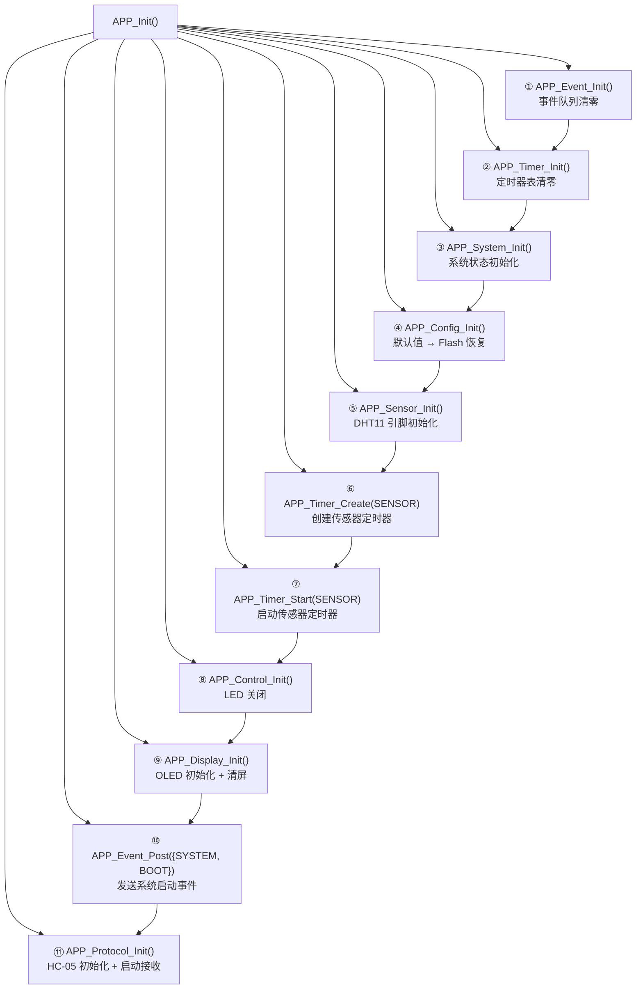
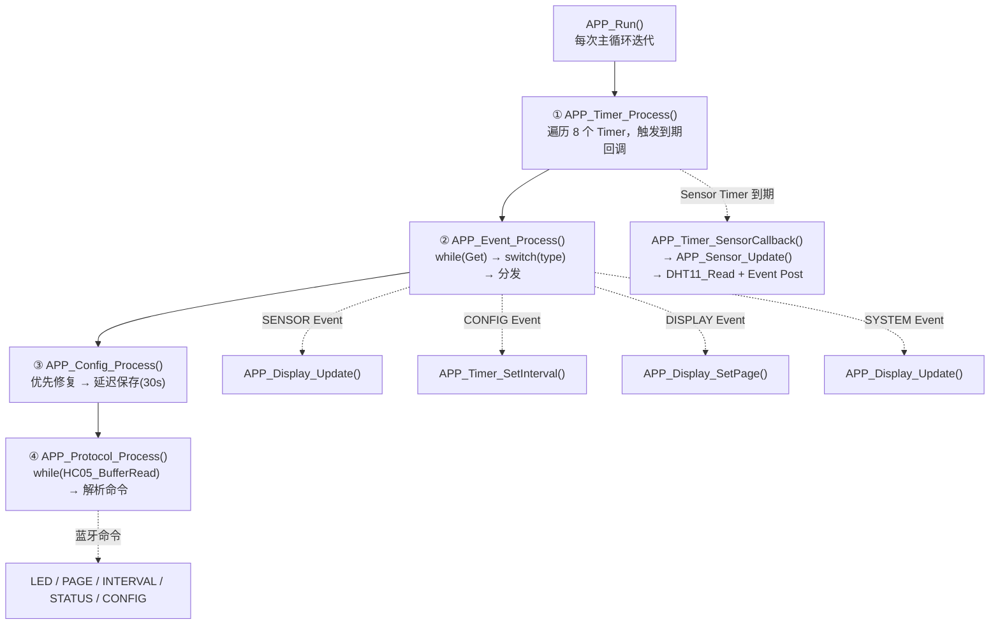

# APP Main 运行流程总结

> **项目**: STM32F407 智能家居 | **版本**: v0.3 | **日期**: 2026-08-02

---

## 1. 系统启动流程

```
Reset_Handler (startup_stm32f407xx.s)
    │
    ├─ SystemInit()                           FPU / 向量表 / 时钟预处理
    └─ __main()                               C 库初始化 → main()
         │
         ▼
main()                                         [Core/Src/main.c:71]
    │
    ├─ HAL_Init()                             SysTick 配置 / NVIC 优先级分组
    │
    ├─ SystemClock_Config()                    HSE(8MHz) → PLL → 168MHz
    │    ├─ SYSCLK = 168MHz
    │    ├─ HCLK   = 168MHz
    │    ├─ PCLK1  = 42MHz  (APB1)
    │    └─ PCLK2  = 84MHz  (APB2)
    │
    ├─ MX_GPIO_Init()                         PC13 → 推挽输出
    ├─ MX_USART1_UART_Init()                  PA9/PA10, 115200-8-N-1 (调试)
    ├─ MX_I2C1_Init()                         PB6/PB7, 100kHz (OLED)
    ├─ MX_USART3_UART_Init()                  PB10/PB11, 9600-8-N-1 (HC-05)
    │
    ├─ Delay_Init()                           DWT 周期计数器使能
    │
    └─ APP_Init()                             ★ 应用层初始化
         │
         └─ [详见第 2 节]

         while (1)
         {
             APP_Run();                       ★ 主循环
         }
```

---

## 2. APP_Init 流程



**初始化要点：**

| 步骤 | 模块 | 关键操作 |
|------|------|---------|
| ① | Event | `head=0, tail=0, count=0, lostEvent=0`，最早就绪 |
| ② | Timer | `memset(timerTable, 0, sizeof)`，8 个槽位清零 |
| ③ | System | `startTick=now, DHT=ERROR, BT=0, Config=ERROR_MAGIC` |
| ④ | Config | `Reset→Load→SetConfigStatus`，尝试 Flash 恢复 |
| ⑤ | Sensor | `DHT11_Init→memset(sensorData+lastSensorData)` |
| ⑥⑦ | Timer | 创建并启动周期传感器定时器 |
| ⑧ | Control | `LED_Off()` |
| ⑨ | Display | `OLED_Init→HAL_Delay(100)→OLED_Clear` |
| ⑩ | Boot | 发送 `{SYSTEM, BOOT}` → 首次 Display 刷新 |

---

## 3. 主循环流程

```c
// [Core/Src/main.c:107-115]
while (1)
{
    APP_Run();
}
```

`main.c` 的主循环极度简洁——所有逻辑委托给 `APP_Run()`。

---

## 4. APP_Run 执行流程



**各步骤详解：**

| 步骤 | 函数 | 耗时 | 说明 |
|------|------|------|------|
| ① | `APP_Timer_Process()` | < 1μs (无到期时) | 遍历 8 槽位，callback 耗时取决于回调内容 |
| ② | `APP_Event_Process()` | < 1μs (队列空时) | while 循环消费全部事件 |
| ③ | `APP_Config_Process()` | < 1μs (无操作时) | 修复 / 保存时可达 1~2s (Flash 擦写) |
| ④ | `APP_Protocol_Process()` | < 1μs (无数据时) | while 读取 RingBuffer 直到空 |

---

## 5. 传感器周期流程

```
APP_Timer_Process()
    │
    └─ [SENSOR Timer 到期: now - lastTick >= interval]
         │
         ▼
    APP_Timer_SensorCallback()           [app.c:23]
         │
         ▼
    APP_Sensor_Update()                  [app_sensor.c:38]
         │
         ├─ DHT11_Read(&sensorData)      (GPIO 位带时序)
         │    └─ 返回 HAL_OK / HAL_TIMEOUT / HAL_ERROR
         │
         ├─ APP_System_SetDHTStatus(ret)
         │
         ├─ [ret == HAL_OK]
         │    ├─ APP_System_SetSensorReady(1)
         │    └─ [memcmp ≠ 0] 数据变化?
         │         └─ APP_Event_Post({SENSOR, UPDATE})  → 入队
         │
         └─ [ret != HAL_OK]
              └─ 不覆盖 sensorData, 不发送 Event

         ↓ (下一轮 APP_Run)

APP_Event_Process()
    │
    └─ case APP_EVENT_SENSOR:
         └─ APP_Display_Update()         OLED 刷新
```

**完整链路：** Timer 到期 → Sensor 采样 → 数据变化检测 → Event 通知 → Display 刷新

---

## 6. 用户命令流程

```
手机 Bluetooth Terminal
    │  输入: PAGE DEBUG\r
    ▼
HC-05 蓝牙模块 (透传)
    │
    ▼
USART3 RX (PB11)  →  USART3_IRQHandler()
    │
    ▼
HAL_UART_RxCpltCallback()               [hc05.c:123]
    ├─ HC05_BufferWrite(ch)             存入 RingBuffer
    └─ HAL_UART_Receive_IT()            重启接收

    ↓ (下一轮 APP_Run)

APP_Protocol_Process()                   [app_protocol.c:41]
    │
    └─ while (HC05_BufferRead(&ch) == 0)
         └─ APP_Protocol_Input(ch)       逐字节缓存
              │
              └─ [ch == '\r']  →  APP_Protocol_Parse("PAGE DEBUG")
                   │
                   ├─ strchr: cmd="PAGE", param="DEBUG"
                   └─ strcmp 匹配 → APP_Cmd_Page("DEBUG")
                        │
                        └─ APP_Event_Post({DISPLAY, PAGE_CHANGED, DEBUG})

    ↓ (下一轮 APP_Run)

APP_Event_Process()
    │
    └─ case APP_EVENT_DISPLAY:
         ├─ APP_Display_SetPage(DEBUG)
         └─ APP_Display_Update()
```

**命令执行路径（按类型分类）：**

| 命令 | 执行路径 |
|------|---------|
| `LED ON` | Protocol → `APP_Control_LED(ON)` → `LED_On()` → GPIO |
| `PAGE HOME` | Protocol → `APP_Event_Post({DISPLAY, PAGE_CHANGED})` → `APP_Display_SetPage()` |
| `INTERVAL 5` | Protocol → `APP_Config_SetSensorInterval(5000)` → `APP_Event_Post({CONFIG, CHANGED})` → `APP_Timer_SetInterval()` |
| `STATUS` | Protocol → 读取 Sensor/System/Control/Config → `HC05_Printf` 输出 |
| `CONFIG` | Protocol → `APP_Config_PrintInfo()` → USART1 调试输出 |

---

## 7. 配置保存流程

```
蓝牙 INTERVAL 5 命令
    │
    ▼
APP_Config_SetSensorInterval(5000)       [app_config.c:410]
    │
    ├─ appConfig.sensorIntervalMs = 5000  (修改 RAM)
    ├─ configDirty = 1                    (标记脏数据)
    ├─ configDirtyTick = HAL_GetTick()    (记录修改时间)
    │
    └─ APP_Event_Post({CONFIG, CHANGED, 5000})
         │
         └─ [下一轮] APP_Event_Process()
              └─ APP_Timer_SetInterval(SENSOR, 5000)  (周期立即生效)

    ...主循环持续运行，30 秒内可多次修改参数...

APP_Config_Process()                     [app_config.c:778]
    │
    └─ [configDirty && HAL_GetTick() - dirtyTick >= 30000]
         │
         ▼
    APP_Config_Save()                    [app_config.c:315]
         │
         ├─ APP_Config_GetWriteTarget()  确定写入 A 还是 B
         ├─ APP_Config_GetNextSequence() max(A,B) + 1
         ├─ 填充 storage {magic, version, length, sequence, data, crc}
         ├─ FLASH_EraseSector(target)    擦除目标 Sector
         ├─ FLASH_Write(target, &storage) 写入
         │
         └─ APP_Event_Post({CONFIG, SAVE_DONE, addr})
              │
              └─ APP_Event_Process()
                   └─ USART_Printf("Config Flash Save Done")
```

---

## 8. 当前裸机调度特点

| 特点 | 说明 |
|------|------|
| **协作式调度** | 所有模块在主循环中顺序执行，无抢占 |
| **时间片由 while 提供** | 主循环迭代频率取决于各模块执行耗时之和 |
| **Timer 统一周期管理** | 8 槽位软件定时器替代分散的 tick 变量 |
| **Event 减少耦合** | Sensor / Protocol 不直接调用 Display / Timer |
| **轮询 + 事件混合** | RingBuffer 轮询（Protocol），其余 Event 驱动 |
| **Flash 异步处理** | 修改配置不阻塞，30 秒后台写入 |

---

## 9. RTOS 迁移映射

| 裸机 | FreeRTOS | 说明 |
|------|----------|------|
| `APP_Run()` 顺序执行 | `SensorTask` + `ProtocolTask` + `DisplayTask` + `ConfigTask` | 4 个独立 Task 并行 |
| `APP_Timer_Process()` 轮询 | FreeRTOS Software Timer (`xTimerCreate`) | Timer Service Task 管理 |
| `APP_Event` 轮询 `Get()` | `xQueueReceive(eventQueue, ..., portMAX_DELAY)` | EventTask 阻塞等待 |
| `APP_Protocol_Process()` 轮询 RingBuffer | ProtocolTask + `xQueueReceive(uartQueue, ...)` | 阻塞等待 UART 数据 |
| `APP_Config_Process()` 后台检查 | ConfigTask + `xTimer` 30s 定时 | 专用 Task，无需轮询 |
| `APP_Display_Update()` 被动调用 | DisplayTask 等待 `xQueueReceive` | Event 通知 → 唤醒刷新 |

**迁移后的 Task 架构：**

```
优先级 高:  ProtocolTask     (UART 数据消费，及时响应)
优先级 中:  SensorTask       (定时采样，周期精准)
优先级 中:  DisplayTask      (OLED 刷新，I2C 阻塞)
优先级 低:  ConfigTask       (Flash 擦写，耗时操作)
优先级 低:  EventTask        (事件分发，汇总调度)
```
