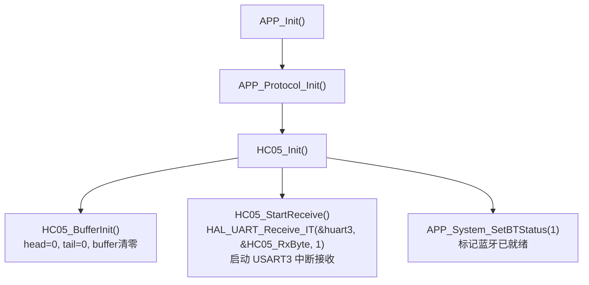
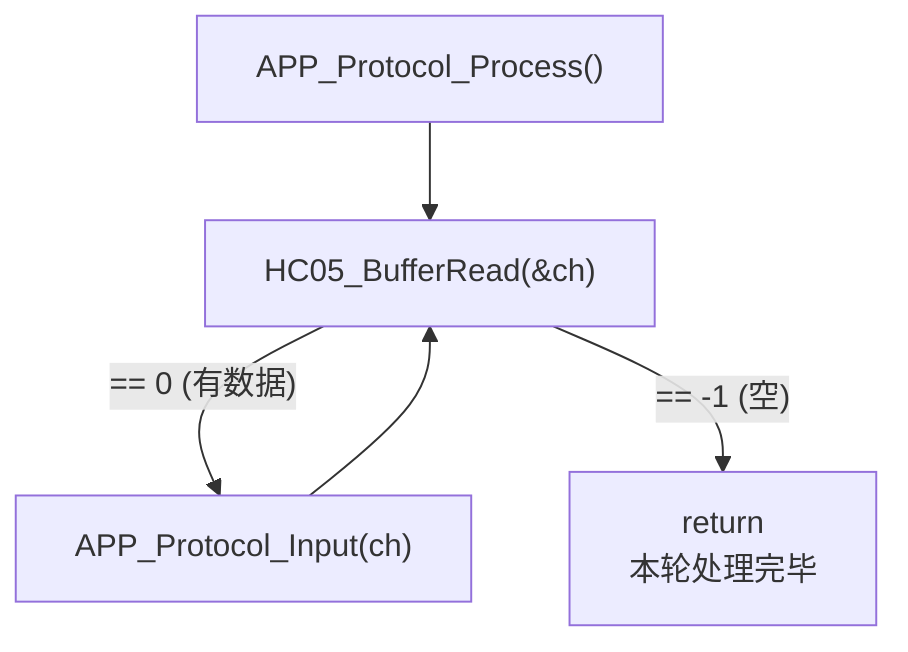
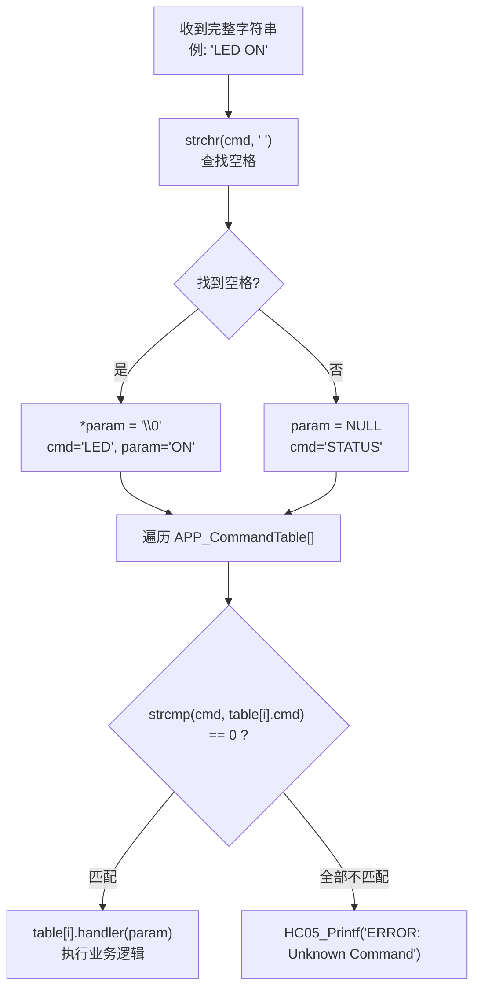

# APP_Protocol 蓝牙命令协议模块设计文档

> **项目**: STM32F407 智能家居 | **版本**: v0.3 | **日期**: 2026-08-02
> **涉及文件**: `APP/app_protocol.c`、`APP/app_protocol.h`

---

# 1. 模块简介

APP_Protocol 是系统的**上层命令解析模块**，通过 HC-05 蓝牙模块接收用户文本命令并分发到各功能模块。

**数据链路：**

```
手机 Bluetooth Terminal App
    │
    ▼  Bluetooth SPP
HC-05 模块
    │
    ▼  UART (TXD↔RXD)
USART3 → RingBuffer (hc05.c)
    │
    ▼  HC05_BufferRead() 轮询
APP_Protocol (本模块)
    │
    ▼  命令匹配 → handler 调用
APP 各功能模块 (Control / Config / Display / Sensor / System / Event)
```

**APP_Protocol 负责**：

- ✅ 从 HC-05 RingBuffer 逐字节读取字符
- ✅ 以 `\r` 为分隔符缓存完整命令行
- ✅ 命令-参数分离（空格分割）
- ✅ 命令表匹配与 handler 分发
- ✅ 通过 HC05_Printf 返回执行结果

**APP_Protocol 不负责**：

- ❌ UART 中断接收（由 `hc05.c` 负责）
- ❌ 蓝牙无线通信（由 HC-05 模块硬件负责）
- ❌ 业务逻辑执行（由各 handler 调用的 APP 模块负责）

---

# 2. 软件结构

## 2.1 文件组织

```
APP/
├── app_protocol.c         # 协议解析实现（Init / Process / 8 个命令 handler）
└── app_protocol.h         # 协议解析头文件（APP_Command_t 结构体 + 接口声明）
```

## 2.2 依赖关系

```
app_protocol.c
    │
    ├── app_control.h      → APP_Control_LED()              LED ON/OFF 命令
    ├── app_sensor.h       → APP_Sensor_GetData()           STATUS 命令读取温湿度
    ├── app_display.h      → APP_Display_SetPage() / ...    PAGE / OLED CLEAR 命令
    ├── app_config.h       → APP_Config_SetSensorInterval() INTERVAL 命令
    │                      → APP_Config_PrintInfo()         CONFIG 命令
    ├── app_system.h       → APP_System_GetUptime() / ...   STATUS 命令
    ├── app_event.h        → APP_Event_Post()               PAGE 命令 (Event 方式)
    ├── hc05.h             → HC05_Init() / HC05_BufferRead() / HC05_Printf()
    ├── usart_driver.h     → USART_Printf(&huart1, ...)     INTERVAL 调试日志
    ├── string.h           → strcmp() / strchr() / memset()
    └── stdlib.h           → atoi()                         字符串转整数
```

---

# 3. 初始化流程

```c
// [APP/app_protocol.c:33-36]
void APP_Protocol_Init(void)
{
    HC05_Init();   // 初始化 HC-05: RingBuffer 清零 → 启动 USART3 中断接收 → 标记蓝牙就绪
}
```



> APP_Protocol 自身无需额外初始化——`APP_CmdBuffer` 和 `APP_CmdIndex` 为 static 变量，编译时自动零初始化。

---

# 4. 接收数据流程

```c
// [APP/app_protocol.c:41-49]
void APP_Protocol_Process(void)
{
    uint8_t ch;

    while (HC05_BufferRead(&ch) == 0)    // 循环读取直到 RingBuffer 为空
    {
        APP_Protocol_Input(ch);           // 逐字节送入命令解析器
    }
}
```

`APP_Protocol_Process()` 由 `APP_Run()` 主循环每次迭代调用。

**完整接收链路：**




---

# 5. 命令缓存设计

```c
// [APP/app_protocol.c:18-21]
#define APP_CMD_MAX_LEN  64
static char     APP_CmdBuffer[APP_CMD_MAX_LEN];   // 命令行缓存
static uint16_t APP_CmdIndex;                      // 当前写入位置
```

**以 `\r` 作为命令结束符**（HC-05 模块和大多数蓝牙终端在每行末尾发送 `\r\n`）。

```c
// [APP/app_protocol.c:344-377]
static void APP_Protocol_Input(uint8_t ch)
{
    if (ch == '\r')                               // ① 回车 → 解析命令
    {
        APP_CmdBuffer[APP_CmdIndex] = '\0';        // 字符串结尾
        if (APP_CmdIndex > 0)
        {
            APP_Protocol_Parse(APP_CmdBuffer);     // 解析执行
        }
        APP_CmdIndex = 0;                          // 重置索引
        memset(APP_CmdBuffer, 0, sizeof(APP_CmdBuffer));  // 清空缓存
        return;
    }

    if (ch == '\n')                                // ② 换行 → 忽略
    {
        return;
    }

    if (APP_CmdIndex < APP_CMD_MAX_LEN - 1)        // ③ 普通字符 → 追加
    {
        APP_CmdBuffer[APP_CmdIndex++] = ch;
    }
    else                                           // ④ 溢出 → 清空 + 报错
    {
        APP_CmdIndex = 0;
        memset(APP_CmdBuffer, 0, sizeof(APP_CmdBuffer));
        HC05_Printf("ERROR: Command Too Long\r\n");
    }
}
```

**状态转换：**

```
空闲 (index=0) → 收到字符 → index++ → ... → 收到 \r → 解析 → index=0 → 空闲
                                              ↓
                                         收到 \n → 忽略, index 不变
                                              ↓
                                         index==63 → 溢出 → 清空, 报错
```

---

# 6. 命令解析流程

```c
// [APP/app_protocol.c:302-339]
static void APP_Protocol_Parse(char *cmd)
{
    uint16_t i;
    char *param = NULL;

    /* 查找第一个空格，分割命令和参数 */
    param = strchr(cmd, ' ');          // ① 定位空格
    if (param != NULL)
    {
        *param = '\0';                 // ② 切断 → cmd 为命令, param+1 为参数
        param++;
    }

    /* 遍历命令表，匹配执行 */
    for (i = 0; i < APP_COMMAND_NUM; i++)
    {
        if (strcmp(cmd, APP_CommandTable[i].cmd) == 0)  // ③ 精确匹配
        {
            APP_CommandTable[i].handler(param);          // ④ 调用 handler
            return;
        }
    }

    HC05_Printf("ERROR: Unknown Command\r\n");           // ⑤ 未匹配
}
```

**解析示例**：用户输入 `LED ON\r`

```
"LED ON"
    │ strchr(cmd, ' ')
    ▼
cmd="LED" (空格被替换为 \0), param="ON"
    │ strcmp(cmd, "LED") == 0 ✓
    ▼
APP_Cmd_LED("ON")
    │ strcmp("ON", "ON") == 0 ✓
    ▼
APP_Control_LED(APP_LED_ON) → LED_On() → HC05_Printf("LED ON OK\r\n")
```



---

# 7. 命令表设计

```c
// [APP/app_protocol.c:281-296]
static const APP_Command_t APP_CommandTable[] =
{
    {"LED",       APP_Cmd_LED},
    {"OLED",      APP_Cmd_OLED},
    {"TEST",      APP_Cmd_Test},
    {"OLED CLR",  APP_Cmd_OLED_Clear},
    {"STATUS",    APP_Cmd_Status},
    {"PAGE",      APP_Cmd_Page},
    {"INTERVAL",  APP_Cmd_SetInterval},
    {"CONFIG",    APP_Cmd_Config},
};
```

```c
// [APP/app_protocol.h:10-16]
typedef struct
{
    const char *cmd;                   // 命令字符串（精确匹配，区分大小写）
    void (*handler)(char *param);      // 处理函数（param 为空格后的参数字符串，可为 NULL）
} APP_Command_t;
```

| 命令 | handler | 参数 | 功能 |
|------|---------|------|------|
| `LED` | `APP_Cmd_LED` | `ON` / `OFF` | 控制板载 LED |
| `OLED` | `APP_Cmd_OLED` | `CLEAR` | OLED 屏操作 |
| `TEST` | `APP_Cmd_Test` | 无 | 通信测试（返回 OK） |
| `OLED CLR` | `APP_Cmd_OLED_Clear` | 无 | 清空 OLED 显示 |
| `STATUS` | `APP_Cmd_Status` | 无 | 输出完整系统状态报告 |
| `PAGE` | `APP_Cmd_Page` | `HOME` / `SENSOR` / `SYSTEM` / `DEBUG` | 切换 OLED 显示页面 |
| `INTERVAL` | `APP_Cmd_SetInterval` | 秒数（数字） | 修改传感器采样周期 |
| `CONFIG` | `APP_Cmd_Config` | 无 | 打印 Flash 配置存储详情 |

---

# 8. 各命令功能说明

## LED

```c
static void APP_Cmd_LED(char *param)
{
    if (param == NULL) { HC05_Printf("ERR PARAM\r\n"); return; }

    if      (strcmp(param, "ON")  == 0) { APP_Control_LED(APP_LED_ON);  HC05_Printf("LED ON OK\r\n");  }
    else if (strcmp(param, "OFF") == 0) { APP_Control_LED(APP_LED_OFF); HC05_Printf("LED OFF OK\r\n"); }
    else                                { HC05_Printf("ERR LED PARAM\r\n"); }
}
```

**参数**：`ON` / `OFF`（区分大小写）

**调用链**：`APP_Control_LED()` → `LED_On()` / `LED_Off()` → `HAL_GPIO_WritePin(PC13)`

## PAGE

```c
static void APP_Cmd_Page(char *param)
{
    APP_Event_t event;
    APP_DisplayPage_t page;

    if      (strcmp(param, "HOME")   == 0) page = DISPLAY_PAGE_HOME;
    else if (strcmp(param, "SENSOR") == 0) page = DISPLAY_PAGE_SENSOR;
    else if (strcmp(param, "SYSTEM") == 0) page = DISPLAY_PAGE_SYSTEM;
    else if (strcmp(param, "DEBUG")  == 0) page = DISPLAY_PAGE_DEBUG;
    else { HC05_Printf("ERR PAGE\r\n"); return; }

    event.type  = APP_EVENT_DISPLAY;
    event.id    = APP_DISPLAY_EVENT_PAGE_CHANGED;
    event.param = page;
    APP_Event_Post(&event);           // ★ 通过 Event 而非直接调用

    if (APP_Event_Post(&event) == APP_EVENT_OK)  // ⚠ 重复 Post! (已知问题)
        HC05_Printf("PAGE %s OK\r\n", param);
    else
        HC05_Printf("EVENT FULL\r\n");
}
```

**参数**：`HOME` / `SENSOR` / `SYSTEM` / `DEBUG`

> **设计亮点**：PAGE 命令不直接调用 `APP_Display_SetPage()`，而是通过 `APP_Event_Post({DISPLAY, PAGE_CHANGED})` 发送事件，由 `APP_Event_Process` 统一分发。Protocol 只负责"通知"，不负责"执行"。

> **已知问题**：`APP_Event_Post()` 在此函数中被调用**两次**（第 146 行和第 152 行），导致同一事件重复入队。第一次用于实际投递，第二次用于判断返回值并输出 `EVENT FULL` 提示。

## STATUS

输出完整系统状态报告（通过 `HC05_Printf` 逐行返回）：

```
------ STATUS ------
Uptime : 3600s
DHT    : OK
BT     : OK
CONFIG : FLASH
Temp : 25.3 C
Humi : 68.5 %
LED  : ON
Page : HOME
Interval : 2s
Mode   : BARE
--------------------
```

**数据来源**：

| 输出项 | 数据来源 |
|--------|---------|
| Uptime | `APP_System_GetUptime()` |
| DHT | `APP_System_GetDHTStatus()` → `HAL_OK ? "OK" : "ERR"` |
| BT | `APP_System_GetBTStatus()` → `? "OK" : "ERR"` |
| CONFIG | `APP_System_GetConfigStatus()` → `== OK ? "FLASH" : "DEFAULT"` |
| Temp | `APP_Sensor_GetData()->temperature / temperature_dec` |
| Humi | `APP_Sensor_GetData()->humidity / humidity_dec` |
| LED | `APP_Control_GetLEDState()` → `== ON ? "ON" : "OFF"` |
| Page | `APP_PageToString(APP_Display_GetPage())` |
| Interval | `APP_Config_GetSensorInterval() / 1000` |

## INTERVAL

```c
static void APP_Cmd_SetInterval(char *param)
{
    uint32_t sec = atoi(param);
    if (sec == 0) { HC05_Printf("ERR VALUE\r\n"); return; }

    APP_Config_SetSensorInterval(sec * 1000);   // ① 修改 RAM 参数
    // → APP_Config 内部发送 APP_CONFIG_EVENT_CHANGED 事件
    // → APP_Event_Process 调用 APP_Timer_SetInterval(SENSOR, new_ms)
}
```

**动态修改采样周期流程：**

```
INTERVAL 5 命令
    │
    ▼
APP_Config_SetSensorInterval(5000)
    ├─ appConfig.sensorIntervalMs = 5000  (修改 RAM)
    ├─ configDirty = 1                    (标记待保存)
    └─ APP_Event_Post({CONFIG, CHANGED, 5000})
         │
         ▼
    APP_Event_Process()
         │
         ▼
    APP_Timer_SetInterval(SENSOR, 5000)    (Timer 周期立即生效)
         │
    ...30 秒后...
         │
    APP_Config_Process() → APP_Config_Save() → Flash 写入
```

## OLED CLEAR

```c
static void APP_Cmd_OLED_Clear(char *param)
{
    APP_Display_Clear();       // → OLED_Clear() + OLED_Refresh()
    HC05_Printf("OK\r\n");
}
```

## CONFIG

```c
static void APP_Cmd_Config(char *param)
{
    if (param != NULL)         // CONFIG 不接受参数
    {
        HC05_Printf("ERROR: CONFIG no parameter\r\n");
        return;
    }
    APP_Config_PrintInfo();    // → USART1 输出双备份详情
}
```

---

# 9. Event 事件交互

APP_Protocol **不直接调用各模块的修改接口**（LED 除外），而是通过 Event 系统解耦。

**PAGE 命令的 Event 驱动流程：**

```
APP_Cmd_Page("DEBUG")
    │
    ├─ 构造 event = {DISPLAY, PAGE_CHANGED, DEBUG}
    └─ APP_Event_Post(&event)
         │
         ▼
    [Event 队列]
         │
         ▼
    APP_Event_Process()
         │
         ▼
    case APP_EVENT_DISPLAY:
        APP_Display_SetPage(DEBUG)
        APP_Display_Update()
```

**INTERVAL 命令的 Event 驱动流程：**

```
APP_Cmd_SetInterval("5")
    │
    └─ APP_Config_SetSensorInterval(5000)
         │
         └─ APP_Event_Post({CONFIG, CHANGED, 5000})
              │
              ▼
         APP_Event_Process()
              │
              ▼
         APP_Timer_SetInterval(SENSOR, 5000)
```

**优势**：Protocol 只需要知道"发送什么事件"，不需要知道"谁来处理"。新增消费者只需在 `APP_Event_Process` 中增加 case，无需修改 Protocol 代码。

---

# 10. 接口总结

**公开接口：**

| 函数 | 返回值 | 作用 | 调用者 |
|------|--------|------|--------|
| `APP_Protocol_Init()` | `void` | 初始化 HC-05（RingBuffer +中断接收 + 蓝牙就绪） | `APP_Init()` |
| `APP_Protocol_Process()` | `void` | 从 RingBuffer 读取所有字节并送入解析器 | `APP_Run()` 主循环 |

**内部静态函数：**

| 函数 | 作用 |
|------|------|
| `APP_Protocol_Input(uint8_t ch)` | 逐字节缓存，`\r` 触发解析，溢出报错 |
| `APP_Protocol_Parse(char *cmd)` | 空格分割命令/参数 → 查表匹配 → 调用 handler |
| `APP_Cmd_LED(param)` | LED ON/OFF 控制 |
| `APP_Cmd_OLED(param)` | OLED CLEAR 控制 |
| `APP_Cmd_OLED_Clear(param)` | OLED 清屏（另一个入口） |
| `APP_Cmd_Test(param)` | 通信测试，返回 OK |
| `APP_Cmd_Status(param)` | 输出完整系统状态报告 |
| `APP_Cmd_Page(param)` | 页面切换（通过 Event） |
| `APP_Cmd_SetInterval(param)` | 修改采样周期（通过 Event） |
| `APP_Cmd_Config(param)` | 打印 Flash 配置详情 |

---

# 11. 容易出错的问题

## 1. 命令超过 64 字节

**现象**：`APP_CMD_MAX_LEN = 64`，超过后 `APP_Protocol_Input()` 清空缓存并返回 `ERROR: Command Too Long`，**之前已缓存的内容全部丢失**。

**当前设计**：不做截断保留，直接丢弃整行——简单粗暴但安全。如果协议扩展，可增大 `APP_CMD_MAX_LEN`。

## 2. 忘记 `\r` 结束符

**现象**：蓝牙终端配置为仅发送 `\n` 作为换行符时，命令永远不会触发解析（`APP_Protocol_Input` 中 `\n` 被直接 `return` 忽略），字符不断追加直到溢出报错。

**解决**：确认蓝牙终端使用 `\r\n` 换行模式（HC-05 串口默认配置）。

## 3. PAGE 事件重复 Post

**代码**：[app_protocol.c:146-161](APP/app_protocol.c#L146)

```c
APP_Event_Post(&event);                    // 第一次投递（实际生效）
if (APP_Event_Post(&event) == APP_EVENT_OK) // 第二次投递（仅用于判断返回值）
```

同一事件被投递两次——第一次已入队，第二次可能再入队一次（如果队列未满）。这会导致 `APP_Event_Process` 处理两次 PAGE_CHANGED，第二次处理时 `currentPage == lastPage`，`IsChanged()` 返回 0，无实际影响，但浪费了一次 Event 槽位。

## 4. HC-05 接收中断未重新启动

APP_Protocol 不直接处理中断，但如果 `hc05.c` 的 `HAL_UART_RxCpltCallback` 中忘记重新调用 `HAL_UART_Receive_IT()`，接收将**永久停止**——`APP_Protocol_Process()` 会一直读到 RingBuffer 变空，之后就再也收不到新数据。

当前 `hc05.c` 在回调末尾正确重新启动了中断接收。

## 5. 参数为空处理

部分命令在 `param == NULL` 时有保护：

```c
// LED 命令
if (param == NULL) { HC05_Printf("ERR PARAM\r\n"); return; }

// PAGE 命令
if (param == NULL) { HC05_Printf("ERR PARAM\r\n"); return; }

// INTERVAL 命令
if (param == NULL) { HC05_Printf("ERR PARAM\r\n"); return; }
```

但 `OLED` 命令在 `param == NULL` 时仅 `return`，无任何错误提示——用户输入 `OLED`（无参数）不会有任何反馈。

## 6. 命令大小写问题

`strcmp` 进行**精确匹配**（区分大小写）。输入 `led on`、`Led ON`、`LED on` 均无法匹配 `LED ON`。这对蓝牙终端用户不友好，未来可考虑将所有输入转为大写后再匹配。

---

# 12. FreeRTOS 迁移注意事项

**当前架构（裸机）：**

```
APP_Run() 主循环
    │
    └─ APP_Protocol_Process()
         └─ while (HC05_BufferRead(&ch) == 0)
              └─ APP_Protocol_Input(ch)
```

**迁移后（FreeRTOS）：**

```c
void ProtocolTask(void *arg)
{
    uint8_t ch;
    while (1)
    {
        // 阻塞等待数据，RingBuffer 替换为 FreeRTOS Queue
        if (xQueueReceive(uartRxQueue, &ch, portMAX_DELAY) == pdPASS)
        {
            APP_Protocol_Input(ch);     // 解析逻辑完全不变
        }
    }
}
```

**替换对照：**

| 当前（裸机） | 迁移后（FreeRTOS） | 说明 |
|------------|-------------------|------|
| `HC05_RingBuffer_t` (128B) | `xQueueCreate(128, sizeof(uint8_t))` | 替换环形缓冲区为 Queue |
| `HC05_BufferRead(&ch)` 轮询 | `xQueueReceive(queue, &ch, portMAX_DELAY)` | 阻塞等待，无数据时挂起 Task |
| `HC05_BufferWrite(ch)` (ISR 中) | `xQueueSendFromISR(queue, &ch, &pxHigherPriorityTaskWoken)` | ISR 中必须用 FromISR 版本 |
| `APP_Protocol_Process()` while 循环 | 移入 ProtocolTask 主循环 | 每次只处理一个字符 |
| `HC05_Printf()` 阻塞发送 | 保持阻塞发送或改为 DMA + 信号量 | 发送不影响其他 Task |

**中断优先级注意事项**：

```c
// USART3 中断优先级必须满足 FreeRTOS 要求
NVIC_SetPriority(USART3_IRQn,
    configLIBRARY_MAX_SYSCALL_INTERRUPT_PRIORITY);  // 通常为 5
```

当前裸机配置为优先级 0:0（最高），在 FreeRTOS 下需要**降低**到 `configMAX_SYSCALL_INTERRUPT_PRIORITY` 之上，否则不能在 ISR 中调用 `xQueueSendFromISR()`。

---

# 13. 当前模块评价

**优点：**

| 方面 | 说明 |
|------|------|
| 命令表设计 | 新增命令只需在 `APP_CommandTable[]` 中加一行 + 编写 handler 函数，无需修改解析逻辑 |
| 模块解耦 | PAGE / INTERVAL 通过 Event 驱动，Protocol 不直接调用 Display / Timer |
| 参数校验 | 各 handler 有 NULL 检查和非法值处理，不会因无效输入崩溃 |
| 扩展性好 | 8 条命令覆盖 LED、OLED、状态、配置、调试等场景 |

**不足：**

| 方面 | 说明 | 改进方向 |
|------|------|---------|
| 无命令历史 | 不支持上箭头回显上次命令 | 增加环形历史缓存 |
| 大小写敏感 | `led on` 无法识别 | 解析前统一 `toupper()` |
| 无权限管理 | 任何人都可通过蓝牙控制 LED | 增加配对密码或命令白名单 |
| 文本协议简单 | 无帧头/帧尾/长度/校验 | 对当前需求足够，复杂场景可升级为二进制协议 |
| PAGE 事件重复 Post | 已知 bug | 删除第一次 Post，仅保留带返回值判断的那次 |

---

# 14. 完整数据流

```
┌─────────────────────────────────────────────────────────┐
│  手机 Bluetooth Terminal                                │
│  用户输入: LED ON\r                                      │
└──────────────────────┬──────────────────────────────────┘
                       │ Bluetooth SPP (2.4GHz)
                       ▼
┌─────────────────────────────────────────────────────────┐
│  HC-05 蓝牙模块                                         │
│  透传模式：蓝牙 → UART 透明转发                           │
└──────────────────────┬──────────────────────────────────┘
                       │ UART: 0x4C 'L', 0x45 'E', 0x44 'D',
                       │       0x20 ' ', 0x4F 'O', 0x4E 'N', 0x0D '\r'
                       ▼
┌─────────────────────────────────────────────────────────┐
│  USART3 (PB10/PB11, 9600-8-N-1)                        │
│  每接收 1 字节 → 触发 USART3_IRQHandler()                 │
└──────────────────────┬──────────────────────────────────┘
                       │ 中断
                       ▼
┌─────────────────────────────────────────────────────────┐
│  HAL_UART_RxCpltCallback (Hardware/hc05.c)              │
│  HC05_BufferWrite(ch) → RingBuffer[head++]              │
│  HAL_UART_Receive_IT() → 重新启动下一次接收               │
└──────────────────────┬──────────────────────────────────┘
                       │ RingBuffer (128B, head/tail)
                       ▼
┌─────────────────────────────────────────────────────────┐
│  APP_Protocol_Process (APP/app_protocol.c)              │
│  while (HC05_BufferRead(&ch) == 0)                      │
│      APP_Protocol_Input(ch)                             │
│          ├─ 'L','E','D',' ','O','N' → cmdBuffer 累积     │
│          └─ '\r' → APP_Protocol_Parse("LED ON")         │
│               ├─ strchr: cmd="LED", param="ON"           │
│               └─ strcmp 匹配 → APP_Cmd_LED("ON")         │
└──────────────────────┬──────────────────────────────────┘
                       │
          ┌────────────┼────────────┐
          ▼            ▼            ▼
┌──────────────┐ ┌──────────┐ ┌──────────┐
│ APP_Control  │ │APP_Event │ │APP_Config│  ...各模块
│ LED_On()     │ │PAGE_CHGD │ │SetIntvl  │
│ PC13=LOW     │ │→Display  │ │→Timer    │
└──────┬───────┘ └──────────┘ └──────────┘
       │
       ▼
┌─────────────────────────────────────────────────────────┐
│  HC05_Printf("LED ON OK\r\n")                           │
│  → USART3 TX (PB10) → HC-05 → 手机收到反馈               │
└─────────────────────────────────────────────────────────┘
```
