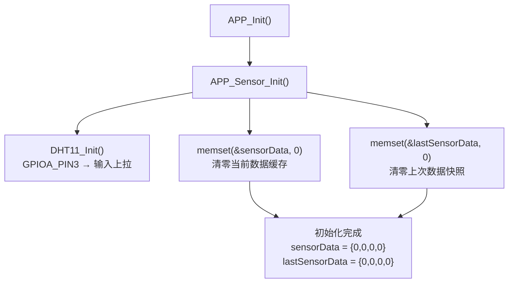
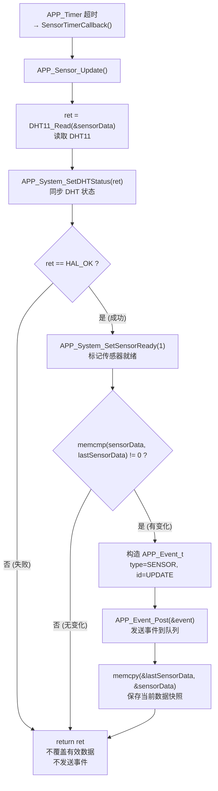

# APP_Sensor 传感器应用管理模块设计文档

> **项目**: STM32F407 智能家居 | **版本**: v0.3 | **日期**: 2026-08-02
> **涉及文件**: `APP/app_sensor.c`、`APP/app_sensor.h`

---

# 1. 模块简介

APP_Sensor 是智能家居系统中的**应用层传感器管理模块**，位于 DHT11 硬件驱动与 APP 业务层之间。

**模块定位**：

```
┌──────────────────────┐
│   DHT11 硬件 (PA3)    │  单总线温湿度传感器
└──────────┬───────────┘
           │ 位带时序通信
           ▼
┌──────────────────────┐
│  DHT11 Driver        │  硬件抽象层：起始信号 / 应答检测 / 40bit 读取 / 校验
│  (Hardware/dht11.c)  │
└──────────┬───────────┘
           │ DHT11_Read(&data)
           ▼
┌──────────────────────┐
│  APP_Sensor          │  ★ 本模块：数据管理 / 变化检测 / 状态同步 / 事件发送
│  (APP/app_sensor.c)  │
└──────────┬───────────┘
           │ APP_Event_Post({SENSOR, UPDATE})
           ▼
┌──────────────────────┐
│  APP_Event           │  事件队列 → APP_Event_Process 分发
└──────────┬───────────┘
           │
           ▼
┌──────────────────────┐
│  APP_Display         │  收到事件 → OLED 刷新温湿度
└──────────┬───────────┘
           │
           ▼
┌──────────────────────┐
│  SSD1306 OLED        │  物理显示
└──────────────────────┘
```

**APP_Sensor 不负责**：

- ❌ DHT11 的 GPIO 时序操作（由 `dht11.c` 负责）
- ❌ OLED 显示刷新（由 `app_display.c` 负责）
- ❌ 事件分发处理（由 `app_event_handle.c` 负责）

**APP_Sensor 负责**：

- ✅ 调用 DHT11 驱动读取数据
- ✅ 管理两份数据缓存（当前值 + 上次值）
- ✅ 数据变化检测（避免无意义刷新）
- ✅ 同步系统状态（DHT 状态 / SensorReady 标志）
- ✅ 在数据变化时发送 Event 通知

---

# 2. 软件结构

## 2.1 文件组织

```
APP/
├── app_sensor.c          # 传感器管理实现（Init / Update / GetData）
└── app_sensor.h          # 传感器管理头文件（接口声明）
```

## 2.2 依赖关系

```
app_sensor.c
    │
    ├── dht11.h            → DHT11_Init() / DHT11_Read() / DHT11_Data_t
    ├── app_system.h       → APP_System_SetDHTStatus() / SetSensorReady()
    ├── app_event.h        → APP_Event_Post() / APP_Event_t / APP_EVENT_SENSOR
    ├── usart.h            → &huart1 (未在当前版本使用)
    ├── usart_driver.h     → USART_Printf() (未在当前版本使用)
    └── string.h           → memset() / memcmp() / memcpy()
```

**被依赖**：

```
app_display.c   → APP_Sensor_GetData()    读取温湿度用于显示
app_protocol.c  → APP_Sensor_GetData()    读取温湿度用于 STATUS 命令
app.c           → APP_Sensor_Update()     通过 Timer 回调间接调用
```

---

# 3. 数据结构设计

```c
// [APP/app_sensor.c:8-9]
static DHT11_Data_t sensorData;       // 当前最新采样数据
static DHT11_Data_t lastSensorData;   // 上一次发送事件时的数据快照
```

| 变量 | 作用 | 写入者 | 读取者 |
|------|------|--------|--------|
| `sensorData` | 当前最新采样数据（每次 `DHT11_Read` 更新） | `APP_Sensor_Update()` | `APP_Sensor_GetData()`, `APP_Display`, `APP_Protocol` |
| `lastSensorData` | 上一次发送 Event 时的数据快照 | `APP_Sensor_Update()` (Event 发送后) | `APP_Sensor_Update()` (变化检测) |

## 为什么需要两个缓存？

```
┌─────────────┐         ┌──────────────────┐
│ sensorData  │  每次   │  lastSensorData  │
│ (当前值)     │  DHT11  │  (上次快照)       │
│             │  Read   │                  │
│  temp: 25.3 │  更新   │  temp: 25.1      │
│  humi: 68.5 │  ────►  │  humi: 68.5      │
└─────────────┘         └──────────────────┘
       │                        │
       │    memcmp() 比较        │
       └────────┬───────────────┘
                │
           [不相等] → 发送 Event → 更新 lastSensorData
           [相等]   → 跳过 (数据未变)
```

**如果没有 `lastSensorData`**，每次 `DHT11_Read` 后都发送 Event → OLED 每秒刷新一次，即使温湿度完全没变。

---

# 4. 初始化流程

```c
// [APP/app_sensor.c:12-27]
void APP_Sensor_Init(void)
{
    DHT11_Init();                                // ① 初始化 DHT11 引脚 (PA3 → 输入上拉)

    memset(&sensorData,     0, sizeof(sensorData));      // ② 清零当前数据
    memset(&lastSensorData, 0, sizeof(lastSensorData));  // ③ 清零上次快照
}
```



> **设计要点**：`lastSensorData` 初始化为全零，首次 DHT11 读取成功后必然与全零不同，因此**首次采样一定会触发 Event**，确保 OLED 从占位符 `--.-` 刷新为真实数据。

---

# 5. 数据更新流程

```c
// [APP/app_sensor.c:38-80]
HAL_StatusTypeDef APP_Sensor_Update(void)
{
    HAL_StatusTypeDef ret;
    APP_Event_t event;

    ret = DHT11_Read(&sensorData);               // ① 调用驱动层读取
    APP_System_SetDHTStatus(ret);                // ② 同步 DHT 状态到系统

    if (ret == HAL_OK)                           // ③ 仅在成功时处理
    {
        APP_System_SetSensorReady(1);            // ④ 标记传感器已就绪

        if (memcmp(&sensorData,                  // ⑤ 数据变化检测
                   &lastSensorData,
                   sizeof(DHT11_Data_t)) != 0)
        {
            event.type  = APP_EVENT_SENSOR;      // ⑥ 发送事件
            event.id    = APP_SENSOR_EVENT_UPDATE;
            event.param = 0;
            APP_Event_Post(&event);

            memcpy(&lastSensorData,              // ⑦ 保存快照
                   &sensorData,
                   sizeof(DHT11_Data_t));
        }
    }

    return ret;
}
```

**完整流程图：**



---

# 6. DHT11 读取流程

```c
ret = DHT11_Read(&sensorData);
```

| 返回值 | 含义 | APP_Sensor 行为 |
|--------|------|----------------|
| `HAL_OK` | 读取成功，校验通过 | 更新 `sensorData`，设置 SensorReady，变化时发送 Event |
| `HAL_TIMEOUT` | 通信超时（DHT11 未响应） | `sensorData` 保留上次有效值，不发送 Event |
| `HAL_ERROR` | 校验和错误 | `sensorData` 保留上次有效值，不发送 Event |

> **关键保护**：DHT11 读取失败时 `sensorData` **不会被覆盖**——因为 `DHT11_Read` 在校验失败时不会修改 `*data` 指向的结构体（校验在数据填充之后？实际上 `dht11.c` 在 checksum 失败时数据已填充到 buffer，但未赋值到 `data->*` 字段——等等，让我确认。实际上看 [dht11.c:251-263](Hardware/dht11.c#L251)，校验失败时 return，不执行后续的 `data->humidity = ...` 赋值。所以失败时 `sensorData` 确实保持原值）。APP_Sensor 在失败时不发送 Event，OLED 继续显示上次的有效数据。

---

# 7. 数据变化检测机制

这是 APP_Sensor 模块的**核心优化**。

```c
// [APP/app_sensor.c:51-75]
if (memcmp(&sensorData, &lastSensorData, sizeof(DHT11_Data_t)) != 0)
{
    // 数据真正变化 → 发送 Event
    APP_Event_Post(&event);
    // 保存新快照
    memcpy(&lastSensorData, &sensorData, sizeof(DHT11_Data_t));
}
```

**优化前后对比：**

| 对比维度 | 优化前（每次都发 Event） | 优化后（变化才发 Event） |
|---------|---------------------|---------------------|
| Event 发送频率 | 每秒 1 次（采样周期） | 仅在温度或湿度实际变化时 |
| OLED I2C 刷新频率 | 每秒 1 次 (~80ms 阻塞) | 仅在数据变化时 |
| CPU 占用 | 持续高 | 数据稳定时几乎为零 |
| 主循环流畅度 | 每 1 秒卡顿 80ms | 几乎无卡顿 |

**场景分析**：室温稳定在 25.3°C、湿度 68.5%，持续 10 分钟：

| 方式 | Event 次数 | OLED 刷新次数 | I2C 传输量 |
|------|----------|-------------|----------|
| 无检测 | 600 次 | 600 次 | ~600KB |
| 有检测 | 1 次（首次） | 1 次 | ~1KB |

---

# 8. Sensor Event 流程

```c
// [APP/app_sensor.c:57-67]
APP_Event_t event;
event.type  = APP_EVENT_SENSOR;           // 事件大类：传感器
event.id    = APP_SENSOR_EVENT_UPDATE;    // 事件 ID：数据更新
event.param = 0;                          // 无附加参数
APP_Event_Post(&event);
```

**完整事件链路：**

```
DHT11 硬件
    │
    ▼
DHT11_Read(&sensorData)              [dht11.c]     时序通信
    │
    ▼
APP_Sensor_Update()                  [app_sensor.c] 变化检测 + Event 发送
    │
    ▼
APP_Event_Post({SENSOR, UPDATE})     [app_event.c]  写入事件队列
    │
    ▼
APP_Event_Process()                  [app_event_handle.c] 从队列取出
    │
    ▼
case APP_EVENT_SENSOR:
    APP_Display_Update()             [app_display.c] 检测变化 → 渲染
    │
    ▼
OLED_Refresh()                       [oled.c]       I2C 写入 SSD1306
    │
    ▼
SSD1306 OLED                         屏幕更新温湿度显示
```

> **Event 参数**：当前 `event.param = 0`（未使用）。未来可扩展为携带变化类型（如 bit0=温度变化, bit1=湿度变化），供 Display 做差异化刷新。

---

# 9. 数据访问接口

```c
// [APP/app_sensor.h:10]
const DHT11_Data_t *APP_Sensor_GetData(void);

// [APP/app_sensor.c:85-88]
const DHT11_Data_t *APP_Sensor_GetData(void)
{
    return &sensorData;
}
```

**返回 `const` 指针**：调用者只能读取，不能修改 `sensorData`——数据写入权限唯一属于 `APP_Sensor_Update()`。

**调用者**：

| 调用者 | 用途 | 代码位置 |
|--------|------|---------|
| `APP_Display_ShowHomePage()` | 获取温湿度渲染 Home 页 | [app_display.c:115](APP/app_display.c#L115) |
| `APP_Display_ShowSensorPage()` | 获取温湿度渲染 Sensor 页 | [app_display.c:146](APP/app_display.c#L146) |
| `APP_Display_IsChanged()` | 判断数据是否变化（显示层自己的缓存对比） | [app_display.c:71-78](APP/app_display.c#L71) |
| `APP_Cmd_Status()` | STATUS 命令返回温湿度 | [app_protocol.c:249-260](APP/app_protocol.c#L249) |

---

# 10. 与 APP_Timer 关系

**当前裸机架构**：

```
SysTick (1ms)
    │
    ▼
HAL_GetTick() 递增
    │
    ▼
APP_Run() → APP_Timer_Process()
    │
    └─ [SENSOR Timer 超时]
         │
         ▼
    APP_Timer_SensorCallback()         [app.c:23]
         │
         ▼
    APP_Sensor_Update()               [app_sensor.c:38]
```

**职责分离**：

| 模块 | 职责 |
|------|------|
| **APP_Timer** | 管理定时周期（何时触发采样） |
| **APP_Sensor** | 管理传感器数据（如何采样 + 数据怎么处理） |

Timer 不关心采样的是什么传感器，Sensor 不关心自己被多快调用——两者通过 `callback` 解耦。

**周期动态调整**：蓝牙 INTERVAL 命令 → `APP_Config_SetSensorInterval()` → `APP_Event(CHANGED)` → `APP_Timer_SetInterval(SENSOR, new_ms)`，Timer 周期改变，Sensor 无需感知。

---

# 11. 与 APP_Display 关系

**错误设计（强耦合）：**

```
OLED 直接调用 DHT11_Read()
    → Display 需要知道 DHT11 的 GPIO、时序、数据结构
    → 换传感器需要改 Display 代码
```

**当前设计（分层解耦）：**

```
DHT11 Driver → APP_Sensor → APP_Event → APP_Display
```

| 分层优势 | 说明 |
|---------|------|
| **Display 不知道传感器类型** | 换 DHT22 只需改 `app_sensor.c`，Display 无感知 |
| **数据变化优化集中在 Sensor 层** | Display 不需要做 `memcmp` 检测 |
| **事件驱动而非轮询** | Display 不主动查询，等 Event 通知才刷新 |
| **多消费者支持** | 未来增加云端上报模块，只需在 `APP_Event_Process` 中增加 case |

---

# 12. 接口总结

| 函数 | 返回值 | 作用 | 调用者 |
|------|--------|------|--------|
| `APP_Sensor_Init()` | `void` | 初始化 DHT11 引脚 + 清零数据缓存 | `APP_Init()` |
| `APP_Sensor_Update()` | `HAL_StatusTypeDef` | 读取 DHT11 → 变化检测 → 发 Event | `APP_Timer_SensorCallback()` |
| `APP_Sensor_GetData()` | `const DHT11_Data_t *` | 返回当前传感器数据（只读） | `APP_Display`, `APP_Protocol` |

---

# 13. 容易出错的问题

## 1. DHT11 读取失败覆盖有效数据

**错误做法**：

```c
// ❌ 无论成功失败都覆盖 sensorData
ret = DHT11_Read(&sensorData);
// sensorData 可能被填入全零或半截数据
APP_Event_Post(...);  // OLED 显示 0.0 C / 0.0 %
```

**当前实现（正确）**：`DHT11_Read` 在校验失败时不修改 `data->*` 字段（[dht11.c:251-253](Hardware/dht11.c#L251) checksum 失败直接 return），`APP_Sensor_Update` 仅在 `ret == HAL_OK` 时才发送 Event。失败时 `sensorData` 保持上次有效值。

## 2. lastSensorData 未初始化导致首次比较异常

**错误**：如果 `lastSensorData` 未初始化（随机值），首次 `memcmp` 结果不可预测——可能与随机值恰好相同，导致首次采样不发送 Event，OLED 永远显示 `--.-`。

**当前实现（正确）**：`APP_Sensor_Init()` 中 `memset(&lastSensorData, 0, sizeof)` 清零。首次 DHT11 成功读取后，真实数据（如 `{25, 3, 68, 5}`）必然与全零不同，保证**首次 Event 一定触发**。

## 3. Event 发送过于频繁

**问题**：如果采样周期设为 500ms，且无变化检测，每 500ms 发送一次 Event → OLED 每 500ms 刷新一次 → 每 500ms 执行 80ms 阻塞 I2C 传输 → 主循环 16% 时间被 I2C 占用。

**当前缓解**：变化检测（`memcmp`）确保仅在温湿度实际变化时才发送 Event。大部分时间环境稳定，Event 发送频率远低于采样频率。

## 4. FreeRTOS 下 sensorData 共享竞争

**裸机无问题**：`APP_Sensor_Update()` 和 `APP_Sensor_GetData()` 都在主循环上下文中，单线程。

**RTOS 下**：如果 Sensor Task 写 `sensorData`，Display Task 同时读 `sensorData`，可能读到半更新数据（温湿度来自两次不同采样）。

**解决**：加 Mutex 保护 `sensorData`，或使用双缓冲（写 buffer A → 指针切换到 A，Display 读 B）。

---

# 14. FreeRTOS 迁移注意事项

**当前架构（裸机）**：

```
APP_Timer → callback → APP_Sensor_Update() → Event → APP_Event_Process → Display
                  (全部在主循环中)
```

**迁移后（FreeRTOS）**：

```c
void SensorTask(void *arg)
{
    TickType_t lastWakeTime = xTaskGetTickCount();

    while (1)
    {
        APP_Sensor_Update();                            // 读取 DHT11 + 发送事件
        vTaskDelayUntil(&lastWakeTime,
                        pdMS_TO_TICKS(interval_ms));    // 精确周期
    }
}
```

**替换对照：**

| 当前（裸机） | 迁移后（FreeRTOS） |
|------------|-------------------|
| `APP_Timer → callback` | `SensorTask` 独立任务 |
| `APP_Event_Post()` | `xQueueSend(eventQueue, &event, 0)` |
| 主循环单线程 (无竞争) | 需要 Mutex 保护 `sensorData` |

**注意**：

- `DHT11_Read()` 内部使用 `Delay_us()`（DWT 忙等），在 RTOS 中仍可使用（不涉及任务切换）
- `HAL_Delay()` 在 DHT11 Start 中调用 `Delay_ms(20)`，实际走 `HAL_Delay`。RTOS 中如果使用 CMSIS-RTOS 封装，`HAL_Delay` 会自动走 `osDelay`。如果未封装，需替换为 `vTaskDelay`
- Event 发送从 `APP_Event_Post()` 改为 `xQueueSend()`，需注意 ISR 版本（`xQueueSendFromISR`）

---

# 15. 当前模块评价

**优点：**

| 方面 | 说明 |
|------|------|
| 分层清晰 | DHT11 Driver (硬件) → APP_Sensor (数据) → APP_Event (消息) → APP_Display (显示) |
| 数据缓存 | `sensorData` + `lastSensorData` 双缓存，失败不丢有效数据 |
| 变化检测 | `memcmp` 避免无意义刷新，降低 I2C 通信量 |
| Event 驱动 | 模块间零直接调用，通过 Event 解耦 |
| 易迁移 RTOS | `APP_Sensor_Update()` 可直接放入 Task，接口不变 |

**不足：**

| 方面 | 说明 | 改进方向 |
|------|------|---------|
| 无数据滤波 | DHT11 偶发跳变值直接使用 | 增加滑动平均窗口（如最近 5 次取中位数） |
| 无异常恢复 | DHT11 连续失败无重试逻辑 | 连续 N 次失败后重新初始化 DHT11 引脚 |
| 单一传感器 | 仅支持 DHT11，扩展需改代码 | 抽象传感器接口（`Sensor_Driver_t`），支持多传感器注册 |
| 无超时保护 | DHT11 通信卡死时无看门狗 | 增加连续通信超时计数 + 硬件复位 |

---

# 16. 完整数据链

**从硬件采样到屏幕显示的完整路径：**

```
┌─────────────────────────────────────────────────────────┐
│  物理世界                                                 │
│  温度: 25.3°C   湿度: 68.5%                               │
└──────────────────────┬──────────────────────────────────┘
                       │
                       ▼
┌─────────────────────────────────────────────────────────┐
│  DHT11 硬件 (PA3)                                       │
│  单总线数字传感器                                          │
└──────────────────────┬──────────────────────────────────┘
                       │ 起始信号 + 40bit 数据 + 校验
                       ▼
┌─────────────────────────────────────────────────────────┐
│  DHT11 Driver (Hardware/dht11.c)                        │
│  DHT11_Read(&sensorData)                                │
│  · GPIO 方向切换 (输出→输入)                               │
│  · DWT 微秒延时 + 位带时序                                 │
│  · 5 字节读取 + 校验和验证                                  │
└──────────────────────┬──────────────────────────────────┘
                       │ DHT11_Data_t {25, 3, 68, 5}
                       ▼
┌─────────────────────────────────────────────────────────┐
│  APP_Sensor (APP/app_sensor.c)                          │
│  APP_Sensor_Update()                                    │
│  · 更新 sensorData                                       │
│  · memcmp 与 lastSensorData 比较                          │
│  · 数据变化 → APP_Event_Post({SENSOR, UPDATE})            │
│  · 更新 lastSensorData 快照                               │
│  · APP_System_SetDHTStatus(HAL_OK)                      │
│  · APP_System_SetSensorReady(1)                         │
└──────────────────────┬──────────────────────────────────┘
                       │ APP_EVENT_SENSOR / UPDATE
                       ▼
┌─────────────────────────────────────────────────────────┐
│  APP_Event 队列 (APP/app_event.c)                        │
│  eventQueue[tail++] = event                              │
└──────────────────────┬──────────────────────────────────┘
                       │ APP_Event_Get()
                       ▼
┌─────────────────────────────────────────────────────────┐
│  APP_Event_Process (APP/app_event_handle.c)              │
│  case APP_EVENT_SENSOR:                                  │
│      APP_Display_Update()                                │
└──────────────────────┬──────────────────────────────────┘
                       │
                       ▼
┌─────────────────────────────────────────────────────────┐
│  APP_Display (APP/app_display.c)                        │
│  · APP_Display_IsChanged()                               │
│  · APP_Display_ShowHomePage()                            │
│  · OLED_Printf("Temp:%d.%d C", 25, 3)                    │
│  · OLED_Refresh() → I2C 写入 SSD1306                      │
└──────────────────────┬──────────────────────────────────┘
                       │ I2C1 (PB6/PB7)
                       ▼
┌─────────────────────────────────────────────────────────┐
│  SSD1306 OLED (128×64)                                  │
│  Smart Home                                              │
│  Temp:25.3 C                                             │
│  Humi:68.5 %                                             │
│  LED : ON                                                │
└─────────────────────────────────────────────────────────┘
```
