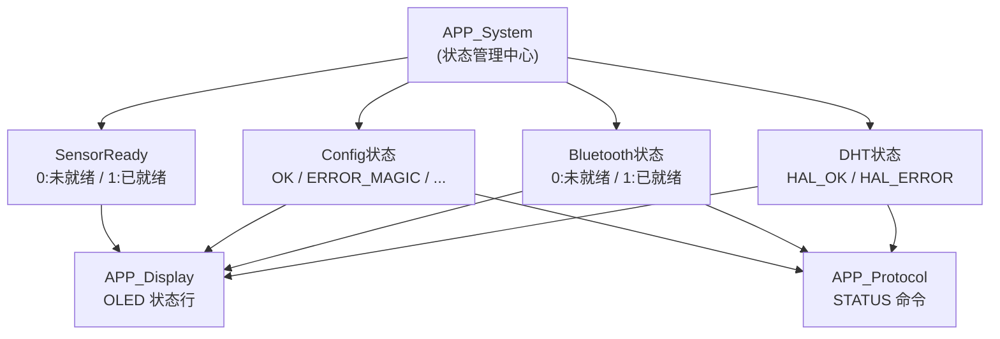
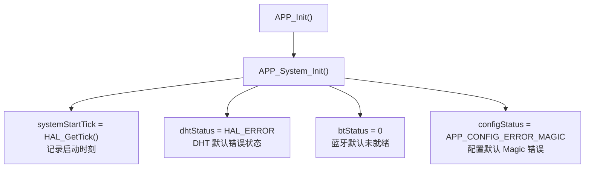
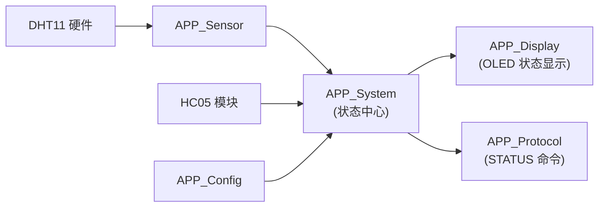

# APP_System 系统状态管理模块总结

> **项目**: STM32F407 智能家居 | **版本**: v0.3 | **日期**: 2026-08-02
> **涉及文件**: `APP/app_system.c`、`APP/app_system.h`、`APP/app_status.h`

---

## 1. 模块简介

APP_System 是应用层**系统状态管理模块**，作为整个 APP 层的状态中心。

**主要作用**：

- 保存系统运行状态（运行时间、外设状态、配置状态、传感器就绪）
- 提供统一状态访问接口（Get/Set 模式）
- 避免模块之间直接访问变量，降低耦合

**当前管理内容：**

| 状态 | 类型 | 说明 |
|------|------|------|
| 系统运行时间 | `uint32_t` | 记录系统启动 Tick，计算运行秒数 |
| DHT 状态 | `HAL_StatusTypeDef` | 记录温湿度传感器最近一次读取结果 |
| Bluetooth 状态 | `uint8_t` | 记录 HC-05 初始化是否完成 |
| Config 状态 | `APP_ConfigStatus_t` | 记录 Flash 配置恢复结果 |
| SensorReady 状态 | `uint8_t` | 记录传感器是否完成首次成功采样 |

**整体结构：**



---

## 2. 设计目的

### 2.1 解决状态分散问题

**早期方式**（模块直接访问外部变量，耦合严重）：

```c
// 错误: Display 直接依赖 Sensor 的实现细节
extern HAL_StatusTypeDef dht_status;   // 跨模块访问变量

if (dht_status == HAL_OK)
{
    OLED 显示 "DHT OK";
}
```

**问题**：
- Display 依赖 Sensor 模块的实现细节（变量名、类型）
- 模块耦合增加，修改 Sensor 内部变量名会破坏 Display
- 无法统一管理状态的读写权限

**当前方式**（通过 APP_System 统一接口）：

```c
// 正确: Display 通过标准接口获取状态
if (APP_System_GetDHTStatus() == HAL_OK)
{
    OLED 显示 "DHT OK";
}
```

### 2.2 降低模块耦合

HC-05 模块**只负责设置状态**，不知道谁在读取：

```c
// [Hardware/hc05.c:37]
void HC05_Init(void)
{
    // ...
    APP_System_SetBTStatus(1);   // 告知系统：蓝牙已就绪
}
```

Display 模块**只负责读取状态**，不知道谁在写入：

```c
// [APP/app_display.c:158-160]
OLED_Printf(0, 32, "HC05: %s",
    APP_System_GetBTStatus() ? "OK" : "ERR");
```

两个模块互不依赖，只通过 APP_System 间接通信。

---

## 3. 文件结构

```
APP/
├── app_system.c          # 状态管理实现（static 变量 + 10 个接口函数）
├── app_system.h          # 状态管理头文件（接口声明）
└── app_status.h          # Config 状态码枚举（APP_ConfigStatus_t）
```

---

## 4. 数据存储设计

当前版本**没有使用统一的状态结构体**，而是采用多个 `static` 静态变量分别保存：

```c
// [APP/app_system.c:4-10]
static uint32_t systemStartTick;                    // 系统启动时刻 (HAL Tick)

static HAL_StatusTypeDef dhtStatus;                 // DHT11 传感器状态
                                                    // HAL_OK       → 读取成功
                                                    // HAL_ERROR    → 初始值 / 读取失败
                                                    // HAL_TIMEOUT  → 通信超时

static uint8_t btStatus;                            // HC-05 蓝牙状态
                                                    // 0 → 未就绪 (初始值)
                                                    // 1 → 已就绪

static APP_ConfigStatus_t configStatus;             // Flash 配置加载状态
                                                    // 详见 app_status.h 枚举 (8 种状态码)

static uint8_t sensorReady = 0;                     // 传感器首次成功采样标志
                                                    // 0 → 未就绪 (初始值)
                                                    // 1 → 已完成首次采样
```

**注意**：`sensorReady` 在**声明时直接初始化**为 0（`= 0`），而不是在 `APP_System_Init()` 中初始化——这是 5 个状态变量中唯一采用此方式的。

---

## 5. 初始化流程

```c
// [APP/app_system.c:12-24]
void APP_System_Init(void)
{
    systemStartTick = HAL_GetTick();                    // 记录启动时刻

    dhtStatus      = HAL_ERROR;                         // DHT 默认为错误状态
    btStatus       = 0;                                 // 蓝牙默认为未就绪
    configStatus   = APP_CONFIG_ERROR_MAGIC;            // 配置默认为 Magic 错误
    // sensorReady 已在声明时初始化为 0，此处不重复
}
```



**默认状态汇总：**

| 状态 | 默认值 | 含义 |
|------|--------|------|
| `systemStartTick` | `HAL_GetTick()` | 记录当前系统 Tick 作为启动时刻 |
| `dhtStatus` | `HAL_ERROR` | 尚未读取 DHT11，假定失败 |
| `btStatus` | `0` | HC-05 尚未初始化 |
| `configStatus` | `APP_CONFIG_ERROR_MAGIC` | Flash 配置尚未验证 |
| `sensorReady` | `0` | 传感器尚未完成首次采样 |

---

## 6. 系统运行时间管理

```c
// [APP/app_system.c:32-40]
uint32_t APP_System_GetUptime(void)
{
    return (HAL_GetTick() - systemStartTick) / 1000;   // 单位：秒
}
```

**实现**：通过 `HAL_GetTick()`（1ms 精度）减去启动时刻，除以 1000 得到运行秒数。

**应用场景**：
- STATUS 命令显示运行时间（`Uptime: 3600s`）
- 调试日志时间戳

---

## 7. DHT 状态管理

### 设置状态

```c
// [APP/app_system.c:44-49]
void APP_System_SetDHTStatus(HAL_StatusTypeDef status)
{
    dhtStatus = status;
}
```

**调用流程：**

```
DHT11_Read(&sensorData)                  [Hardware/dht11.c]
    │  返回 HAL_OK / HAL_TIMEOUT / HAL_ERROR
    ▼
APP_Sensor_Update()                      [APP/app_sensor.c:38]
    │
    ├─ ret = DHT11_Read(&sensorData)
    └─ APP_System_SetDHTStatus(ret)       ← 同步写入系统状态
```

### 获取状态

```c
// [APP/app_system.c:52-55]
HAL_StatusTypeDef APP_System_GetDHTStatus(void)
{
    return dhtStatus;
}
```

**用途**：
- OLED SYSTEM 页：`DHT OK` / `DHT ERR`
- STATUS 命令：`DHT: OK` / `DHT: ERR`

---

## 8. Bluetooth 状态管理

### 设置状态

```c
// [APP/app_system.c:59-62]
void APP_System_SetBTStatus(uint8_t status)
{
    btStatus = status;
}
```

**调用者**：`HC05_Init()` 完成初始化后设置：

```c
// [Hardware/hc05.c:29-38]
void HC05_Init(void)
{
    HC05_BufferInit();
    HC05_StartReceive();
    APP_System_SetBTStatus(1);       // ← 标记蓝牙已就绪
}
```

### 获取状态

```c
// [APP/app_system.c:66-69]
uint8_t APP_System_GetBTStatus(void)
{
    return btStatus;
}
```

**用途**：
- OLED SYSTEM 页：`HC05: OK` / `HC05: ERR`
- STATUS 命令：`BT: OK` / `BT: ERR`

---

## 9. Config 状态管理

### 设置状态

```c
// [APP/app_system.c:71-76]
void APP_System_SetConfigStatus(APP_ConfigStatus_t status)
{
    configStatus = status;
}
```

**调用流程：**

```
APP_Config_Init()                        [APP/app_config.c:47]
    │
    ├─ APP_Config_Reset()
    └─ status = APP_Config_Load()        ← 尝试从 Flash 恢复配置
         │  返回 APP_CONFIG_OK / ERROR_MAGIC / ERROR_CRC / ...
         ▼
    APP_System_SetConfigStatus(status)    ← 保存加载结果到系统状态
```

**状态码定义**（`APP/app_status.h`）：

| 枚举值 | 含义 |
|--------|------|
| `APP_CONFIG_OK` (0) | Flash 配置加载成功 |
| `APP_CONFIG_ERROR_MAGIC` | Magic 号不匹配 |
| `APP_CONFIG_ERROR_VERSION` | 版本号不匹配 |
| `APP_CONFIG_ERROR_LENGTH` | 数据长度不匹配 |
| `APP_CONFIG_ERROR_CRC` | CRC32 校验失败 |
| `APP_CONFIG_ERROR_VALUE` | 参数值超出范围 |
| `APP_CONFIG_ERROR_FLASH_Erase` | Flash 擦除失败 |
| `APP_CONFIG_ERROR_FLASH_Write` | Flash 写入失败 |

### 获取状态

```c
// [APP/app_system.c:79-82]
APP_ConfigStatus_t APP_System_GetConfigStatus(void)
{
    return configStatus;
}
```

**用途**：
- OLED SYSTEM 页：`CFG: OK` / `CFG: ERR`
- STATUS 命令：`CONFIG: FLASH` / `CONFIG: DEFAULT`

---

## 10. SensorReady 状态管理

### 设计目的

用于区分**启动阶段**和**正常运行阶段**：

| 阶段 | `sensorReady` | 含义 |
|------|-------------|------|
| 启动阶段 | `0` | DHT11 尚未完成首次读取，显示层不应显示无效数据 |
| 正常运行 | `1` | DHT11 首次成功读取，数据有效 |

### 设置状态

```c
// [APP/app_system.c:84-89]
void APP_System_SetSensorReady(uint8_t ready)
{
    sensorReady = ready;
}
```

**调用者**：`APP_Sensor_Update()` 在 DHT11 读取成功后设置：

```c
// [APP/app_sensor.c:45-47]
if (ret == HAL_OK)
{
    APP_System_SetSensorReady(1);   // ← 标记传感器已就绪
    // ... 发送 SENSOR UPDATE 事件
}
```

### 获取状态

```c
// [APP/app_system.c:92-95]
uint8_t APP_System_IsSensorReady(void)
{
    return sensorReady;
}
```

> **命名惯例**：读取 SensorReady 状态的函数名是 `IsSensorReady`（而非 `GetSensorReady`），遵循布尔查询的命名惯例，返回 0/1 表示 `false`/`true`。

---

## 11. 模块关系



**调用关系矩阵：**

| 调用者 | SetDHT | GetDHT | SetBT | GetBT | SetConfig | GetConfig | SetSensorReady | IsSensorReady | GetUptime |
|--------|--------|--------|-------|-------|-----------|-----------|---------------|--------------|-----------|
| `APP_Sensor_Update` | ✅ | — | — | — | — | — | ✅ | — | — |
| `HC05_Init` | — | — | ✅ | — | — | — | — | — | — |
| `APP_Config_Init` | — | — | — | — | ✅ | — | — | — | — |
| `APP_Display` | — | ✅ | — | ✅ | — | ✅ | — | — | — |
| `APP_Protocol` | — | ✅ | — | ✅ | — | ✅ | — | — | ✅ |

> **设计原则**：APP_System 负责**保存**状态，不负责**产生**数据。数据由各模块（Sensor / HC05 / Config）产生后通过 Set 接口写入，由消费者模块（Display / Protocol）通过 Get 接口读取。

---

## 12. 当前设计优点

### 简单可靠

使用 `static` 变量存储状态：
- 无动态内存分配（零堆开销）
- 生命周期固定（编译时确定，复位后初始化）
- 无内存泄漏风险

### 接口统一

其他模块**不能**直接访问内部变量（`dhtStatus` 等为 `static`），必须通过 Get/Set 接口：
- 统一的命名规范：`APP_System_SetXxx` / `APP_System_GetXxx`
- 便于后续添加访问控制（互斥锁 / 权限检查）

### RTOS 友好

状态读写接口可以无缝升级为线程安全版本：
- 在 Set/Get 内部添加 Mutex 保护
- 或用 FreeRTOS EventGroup 替代部分布尔状态

---

## 13. 当前设计不足

### 13.1 状态变量分散

**当前**：5 个独立的 `static` 变量：

```c
static uint32_t systemStartTick;
static HAL_StatusTypeDef dhtStatus;
static uint8_t btStatus;
static APP_ConfigStatus_t configStatus;
static uint8_t sensorReady;
```

**未来可升级为统一结构体**：

```c
typedef struct
{
    uint32_t startTick;
    HAL_StatusTypeDef dht;
    uint8_t bt;
    APP_ConfigStatus_t config;
    uint8_t sensorReady;
} APP_SystemStatus_t;

static APP_SystemStatus_t sysStatus;   // 统一管理
```

### 13.2 没有状态变化通知

**当前**：Display 主动轮询读取状态（每次 `APP_Display_Update()` 中调用 `IsChanged()` 对比）。

**未来 FreeRTOS**：可通过以下方式实现推送式通知：
- **EventGroup**：每种状态对应一个 Bit（`SENSOR_READY_BIT` / `BT_READY_BIT`），Task 可阻塞等待
- **Queue**：状态变化时发送消息通知订阅者
- **Task Notification**：单一 Task 可使用直接通知

### 13.3 `sensorReady` 仅在首次成功时置 1

当前 `APP_System_SetSensorReady(1)` 只会被调用一次（在首次 DHT11 读取成功后），之后即使 DHT11 读取失败，`sensorReady` 也不会被重置为 0。这意味着它只表示"曾经成功过"，而非"当前是否可用"。

---

## 14. FreeRTOS 迁移注意事项

**当前裸机架构：**

```
Sensor → APP_System_SetDHTStatus()
                  │
                  ▼
            static dhtStatus
                  │
                  ▼
Display ← APP_System_GetDHTStatus()  (轮询读取)
```

**迁移 RTOS 后：**

```
SensorTask → APP_System_SetDHTStatus()   (持 Mutex 写入)
                  │
                  ▼
         System State (Mutex 保护)
                  │
                  ▼
DisplayTask ← APP_System_GetDHTStatus()  (持 Mutex 读取)
```

**同步方案建议：**

| 方案 | 适用场景 |
|------|---------|
| **Mutex** | 多个 Task 并发读写状态变量时，在 Set/Get 函数内部加锁 |
| **EventGroup** | 多个 Task 需要等待多个状态位就绪时（如等待 `SENSOR_READY & BT_READY & CONFIG_OK`） |
| **Queue + Notification** | 状态消费者需要立即响应变化时，Set 端发送通知唤醒等待 Task |

**迁移要点**：
- `static` 变量无需改动（每个 Task 可见，只需加同步原语）
- Get/Set 接口签名**完全不变**，只在函数体内加锁
- `APP_System_GetUptime()` 中 `HAL_GetTick()` 改为 `xTaskGetTickCount()` 获得 RTOS Tick

---

## 15. 接口总结

| 函数 | 返回值 | 作用 | 调用者 |
|------|--------|------|--------|
| `APP_System_Init()` | `void` | 初始化所有状态为默认值 | `APP_Init()` |
| `APP_System_GetUptime()` | `uint32_t` | 获取系统运行秒数 | `APP_Protocol` (STATUS 命令) |
| `APP_System_SetDHTStatus(status)` | `void` | 设置 DHT11 传感器状态 | `APP_Sensor_Update()` |
| `APP_System_GetDHTStatus()` | `HAL_StatusTypeDef` | 读取 DHT11 传感器状态 | `APP_Display` / `APP_Protocol` |
| `APP_System_SetBTStatus(status)` | `void` | 设置蓝牙就绪状态 | `HC05_Init()` |
| `APP_System_GetBTStatus()` | `uint8_t` | 读取蓝牙就绪状态 (0/1) | `APP_Display` / `APP_Protocol` |
| `APP_System_SetConfigStatus(status)` | `void` | 设置 Flash 配置加载状态 | `APP_Config_Init()` |
| `APP_System_GetConfigStatus()` | `APP_ConfigStatus_t` | 读取 Flash 配置加载状态 | `APP_Display` / `APP_Protocol` |
| `APP_System_SetSensorReady(ready)` | `void` | 设置传感器就绪标志 | `APP_Sensor_Update()` |
| `APP_System_IsSensorReady()` | `uint8_t` | 读取传感器就绪标志 (0/1) | `APP_Display` |

---

## 16. 总结

APP_System 是整个 APP 层的**状态中心**。

**核心设计思想：**

> **模块产生状态 → APP_System 保存状态 → 其他模块读取状态**

这一模式带来的收益：
1. **解耦**：生产者（Sensor / HC05 / Config）和消费者（Display / Protocol）互不依赖
2. **可控**：所有状态读写经过统一接口，便于添加访问控制和同步
3. **可移植**：Get/Set 接口与具体存储方式解耦，FreeRTOS 迁移时仅需修改函数体内实现

**当前已管理状态**：
- ✅ DHT 传感器状态（`HAL_OK` / `HAL_ERROR` / `HAL_TIMEOUT`）
- ✅ HC-05 蓝牙状态（就绪 / 未就绪）
- ✅ Flash 配置状态（8 种详细错误码）
- ✅ SensorReady 标志（首次成功采样）
- ✅ 系统运行时间（秒级）
