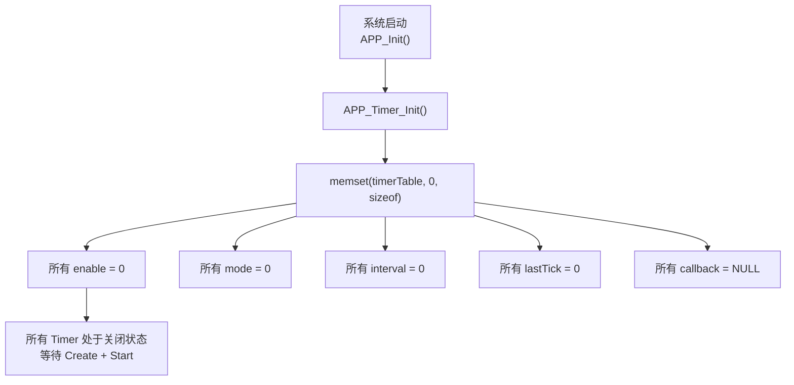
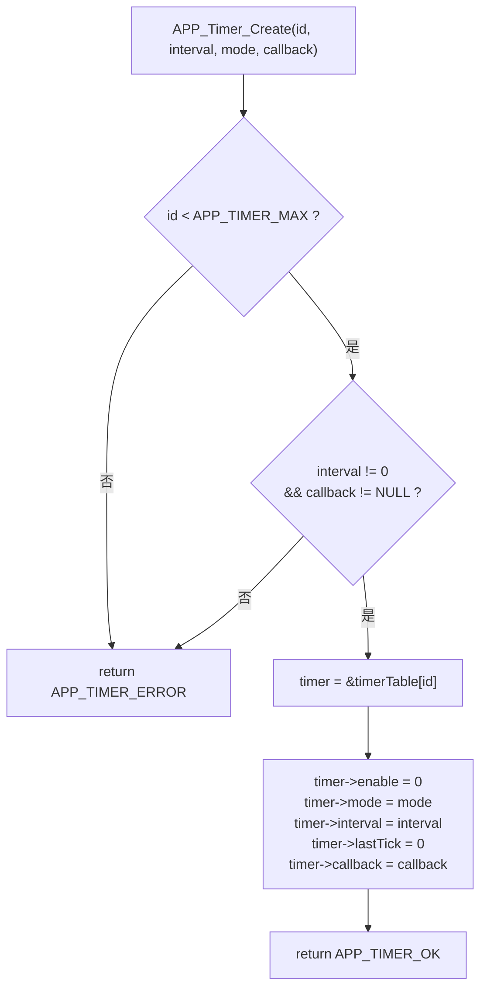
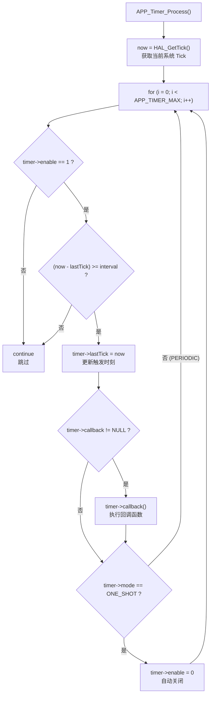

# APP_Timer 软件定时器模块总结

> **项目**: STM32F407 智能家居 | **版本**: v0.3 | **日期**: 2026-08-02
> **涉及文件**: `APP/app_timer.c`、`APP/app_timer.h`

---

## 1. 模块简介

APP_Timer 是应用层**软件定时器模块**，基于 `HAL_GetTick()` 实现，不依赖硬件 Timer 外设。

**主要功能：**

- 创建软件定时器（周期 / 单次）
- 启动 / 停止定时器
- 运行时动态修改定时周期
- 周期检测与超时回调
- 统一管理所有时间驱动任务

**实现基础：**

```c
HAL_GetTick()   // 1ms 精度，由 SysTick_Handler → HAL_IncTick() 驱动
```

> 不需要占用 STM32 的硬件 TIM 资源，所有定时功能通过软件轮询实现。

---

## 2. 设计目的

**传统裸机方式**（时间判断分散在各处）：

```c
while (1)
{
    static uint32_t sensorTick = 0;
    if (HAL_GetTick() - sensorTick >= 1000)
    {
        sensorTick = HAL_GetTick();
        APP_Sensor_Update();        // 每 1 秒执行
    }

    static uint32_t displayTick = 0;
    if (HAL_GetTick() - displayTick >= 500)
    {
        displayTick = HAL_GetTick();
        APP_Display_Update();       // 每 500ms 执行
    }
    // ... 每个任务都要写一套 tick 判断逻辑
}
```

**存在的问题：**

- 时间判断逻辑分散在各模块，代码重复
- 修改周期需要找到对应的 `static tick` 变量
- 后期增加新定时任务需要复制粘贴相同逻辑
- 无法统一查看系统中有哪些定时任务

**引入 APP_Timer 后：**

```
定义任务 → 创建 Timer（周期 + 回调） → 启动 → 自动按时触发回调
```

所有定时任务集中管理，新增任务只需一行 `APP_Timer_Create()`。

---

## 3. 文件结构

```
APP/
├── app_timer.c          # 软件定时器实现（Init / Create / Start / Stop / SetInterval / Process）
└── app_timer.h          # 软件定时器头文件（ID 枚举 / 结构体 / 接口声明）
```

**依赖关系：**

```
app_timer.c
    │
    ├── app_timer.h          ← 自身头文件
    ├── stm32f4xx_hal.h      ← HAL_GetTick()
    └── string.h             ← memset()
```

> APP_Timer 仅依赖 HAL Tick，不依赖任何其他 APP 模块，具有完全的独立性。

---

## 4. 核心数据结构

```c
// [APP/app_timer.c:28]
static APP_Timer_t timerTable[APP_TIMER_MAX];   // APP_TIMER_MAX = 8
```

**作用**：保存系统中所有软件定时器对象，每个 Timer 通过其 ID 作为数组索引直接访问。

**当前工程中的实际分配：**

| 索引 | Timer ID | 用途 | 模式 |
|------|----------|------|------|
| 0 | `APP_TIMER_SENSOR` | 传感器采样定时 | 周期 |
| 1 | `APP_TIMER_CONFIG` | 配置保存定时（预留） | — |
| 2 | `APP_TIMER_DISPLAY` | 显示刷新定时（预留） | — |
| 3 | `APP_TIMER_TEST` | 测试定时（预留） | — |
| 4~7 | — | 未使用 | — |

---

## 5. Timer 对象设计

```c
// [APP/app_timer.h:57-69]
typedef struct
{
    uint8_t         enable;      // 定时器使能状态 (0=关闭, 1=运行)
    APP_TimerMode_t mode;        // 定时器模式 (ONE_SHOT / PERIODIC)
    uint32_t        interval;    // 定时周期 (ms)
    uint32_t        lastTick;    // 上次触发时的 HAL Tick 值
    void (*callback)(void);      // 超时回调函数指针
} APP_Timer_t;
```

| 成员 | 类型 | 作用 | 说明 |
|------|------|------|------|
| `enable` | `uint8_t` | 运行开关 | `Create` 后默认为 0，需 `Start` 才置 1 |
| `mode` | `APP_TimerMode_t` | 触发模式 | `PERIODIC` = 重复触发 / `ONE_SHOT` = 触发一次后自动关闭 |
| `interval` | `uint32_t` | 定时周期 (ms) | 可在运行时通过 `SetInterval` 动态修改 |
| `lastTick` | `uint32_t` | 上次触发时刻 | `Start` 时记录当前 Tick，触发后更新 |
| `callback` | `void(*)(void)` | 回调函数 | 超时时调用，不传参数 |

---

## 6. Timer 模式

```c
// [APP/app_timer.h:44-50]
typedef enum
{
    APP_TIMER_MODE_ONE_SHOT  = 0,   // 单次模式：触发一次后自动关闭
    APP_TIMER_MODE_PERIODIC         // 周期模式：每隔 interval ms 重复触发
} APP_TimerMode_t;
```

### 周期模式 (PERIODIC)

```
触发回调 → 更新 lastTick → enable 保持 1 → 下次 interval 到期再次触发 → ...
```

**应用**：传感器采样——每隔固定时间读取一次 DHT11。

### 单次模式 (ONE_SHOT)

```
触发回调 → 更新 lastTick → enable = 0 (自动关闭)
```

**应用**：延时任务——如"3 秒后执行某操作"。

```c
// [APP/app_timer.c:330-334] ONE_SHOT 自动关闭逻辑
if (timer->mode == APP_TIMER_MODE_ONE_SHOT)
{
    timer->enable = 0;   // 触发后立即关闭，不会再次触发
}
```

---

## 7. 初始化流程

```c
// [APP/app_timer.c:48-65]
void APP_Timer_Init(void)
{
    memset(timerTable, 0, sizeof(timerTable));
}
```

**流程：**



---

## 8. 创建 Timer 流程

```c
// [APP/app_timer.c:91-138]
uint8_t APP_Timer_Create(
    APP_TimerId_t id,              // Timer ID (0 ~ APP_TIMER_MAX_ID-1)
    uint32_t     interval,         // 定时周期 (ms)，不能为 0
    APP_TimerMode_t mode,          // ONE_SHOT 或 PERIODIC
    void (*callback)(void)         // 超时回调函数，不能为 NULL
);
```

**参数校验：**

```c
if (id >= APP_TIMER_MAX)           return APP_TIMER_ERROR;   // ID 越界
if (interval == 0 || callback == NULL) return APP_TIMER_ERROR;   // 参数无效
```

**流程：**



> **注意**：创建后 `enable = 0`（默认关闭），需要调用 `APP_Timer_Start()` 才开始运行。

---

## 9. 启动 Timer 流程

```c
// [APP/app_timer.c:153-195]
uint8_t APP_Timer_Start(APP_TimerId_t id);
```

```c
// 关键代码
if (id >= APP_TIMER_MAX)        return APP_TIMER_ERROR;   // ID 越界
if (timer->callback == NULL)    return APP_TIMER_ERROR;   // 未 Create

timer->lastTick = HAL_GetTick();   // ★ 记录当前 Tick 作为计时起点
timer->enable   = 1;               // 使能
```

**设计要点**：`lastTick` 在 `Start` 时记录当前时刻，而非 `Create` 时。这意味着从 `Start` 调用后经过 `interval` ms 才触发第一次回调，而非从 `Create` 开始计时。

---

## 10. 停止 Timer 流程

```c
// [APP/app_timer.c:209-229]
uint8_t APP_Timer_Stop(APP_TimerId_t id);
```

```c
if (id >= APP_TIMER_MAX)    return APP_TIMER_ERROR;   // ID 越界

timer->enable = 0;                                     // 关闭即可
return APP_TIMER_OK;
```

停止后 `interval` 和 `callback` 保留不变，可随时通过 `Start` 重新启动。

---

## 11. 修改 Timer 周期

```c
// [APP/app_timer.c:246-267]
uint8_t APP_Timer_SetInterval(APP_TimerId_t id, uint32_t interval);
```

```c
if (id >= APP_TIMER_MAX)    return APP_TIMER_ERROR;   // ID 越界
if (interval == 0)          return APP_TIMER_ERROR;   // 周期不能为 0

timer->interval = interval;                            // 更新周期
return APP_TIMER_OK;
```

**与配置系统的联动：**

```
蓝牙 INTERVAL 命令
    │
    ▼
APP_Config_SetSensorInterval(2000)      修改 RAM 配置
    │
    ▼
APP_Event_Post({CONFIG, CHANGED, 2000}) 发送事件
    │
    ▼
APP_Event_Process()
    │
    ▼
APP_Timer_SetInterval(SENSOR, 2000)     立即生效，无需重启 Timer
```

---

## 12. Timer 核心处理流程

```c
// [APP/app_timer.c:277-339]
void APP_Timer_Process(void);
```

由主循环 `APP_Run()` 每次迭代调用：

```c
// [APP/app.c:82]
void APP_Run(void)
{
    APP_Timer_Process();     // ← 第一个执行，确保定时任务准时
    APP_Event_Process();
    APP_Config_Process();
    APP_Protocol_Process();
}
```

**完整处理流程：**



---

## 13. 超时判断机制

使用**差值比较**而非绝对值比较：

```c
if ((now - timer->lastTick) >= timer->interval)   // ★ 差值方式
```

**为什么用差值而非绝对值：**

| 方式 | 代码 | `HAL_GetTick()` 溢出后 |
|------|------|----------------------|
| ❌ 绝对值 | `if (now >= targetTime)` | 溢出后 `now` 变小，永远不触发 |
| ✅ 差值 | `if ((now - lastTick) >= interval)` | 无符号减法自动处理溢出回绕 |

`HAL_GetTick()` 返回 `uint32_t`，约 49.7 天溢出一次（4294967295 ms ÷ 86400000 ms/天）。差值比较利用**无符号整数减法的模运算特性**自动处理回绕：

```
now=100, lastTick=4294967200, interval=1000
now - lastTick = 100 - 4294967200 = 196 (mod 2³²) < 1000 → 未超时  ✓
```

---

## 14. Timer Callback 设计

**设计原则**：Timer 回调只负责"通知"，不执行耗时业务。

```c
// 推荐：回调中发送 Event，由 Event 系统分发到业务处理
void SensorTimerCallback(void)
{
    APP_Sensor_Update();    // 读取传感器 + 发送 SENSOR UPDATE 事件
}
```

```c
// 错误：回调中执行阻塞操作
void BadCallback(void)
{
    HAL_Delay(1000);        // ❌ 阻塞主循环 1 秒
    FLASH_EraseSector();    // ❌ Flash 操作耗时且影响中断响应
}
```

**当前回调无参数**：

```c
void (*callback)(void);     // 无法传递上下文
```

回调函数只能访问全局变量或 static 变量。未来可升级为带 `void *arg` 参数的形式。

---

## 15. 当前工程实际应用

### 传感器采样定时器

**创建**（`APP_Init` 中）：

```c
// [APP/app.c:48-53]
APP_Timer_Create(
    APP_TIMER_SENSOR,                     // ID
    APP_Config_GetSensorInterval(),       // interval = 默认 1000ms
    APP_TIMER_MODE_PERIODIC,              // 周期模式
    APP_Timer_SensorCallback              // 回调
);

APP_Timer_Start(APP_TIMER_SENSOR);        // 启动
```

**回调**（`app.c` 中定义）：

```c
// [APP/app.c:23-26]
static void APP_Timer_SensorCallback(void)
{
    APP_Sensor_Update();   // 读取 DHT11 → 数据变化时发送 SENSOR UPDATE 事件
}
```

**运行时修改周期**（蓝牙 INTERVAL 命令触发）：

```
APP_Event_Process() → APP_Timer_SetInterval(SENSOR, 2000) → 周期从 1000ms 变为 2000ms
```

**完整链路：**

```
SysTick (1ms)
    │
    ▼
HAL_GetTick() 递增
    │
    ▼
APP_Timer_Process()  检测 SENSOR Timer 超时
    │
    ▼
APP_Timer_SensorCallback()
    │
    ▼
APP_Sensor_Update()
    ├─ DHT11_Read()
    └─ APP_Event_Post({SENSOR, UPDATE})    ← 数据变化时发送事件
         │
         ▼
    APP_Event_Process()
         │
         ▼
    APP_Display_Update()                    ← 刷新 OLED
```

---

## 16. Timer 执行时间分析

`APP_Timer_Process()` 自身开销极小：

- `APP_TIMER_MAX = 8`，每次主循环遍历 8 个 Timer 对象
- 每个对象仅做 2~3 次整数比较，总耗时 < 1μs

**主要耗时来自 callback**。因此 callback 应遵循"快速返回"原则：

| ✅ 推荐 | ❌ 避免 |
|--------|--------|
| `APP_Event_Post()` (< 1μs) | `HAL_Delay(1000)` (阻塞 1s) |
| 设置标志位 | `HAL_FLASH_Program()` (阻塞 ~20μs/word) |
| 写入 RingBuffer | `HAL_I2C_Master_Transmit()` (阻塞 ~80ms) |

---

## 17. 回调重入风险

**当前裸机环境**：

```
main loop
    │
    └─ APP_Timer_Process()
         └─ callback()        ← 单线程执行，无重入风险
```

不会发生重入——callback 在主循环上下文中同步执行，执行完才返回 `APP_Timer_Process()`。

**潜在风险场景**（当前未发生）：

如果 ISR 中调用 `APP_Timer_Start()` / `APP_Timer_Stop()` 修改 `enable` 或 `lastTick`，而主循环正在 `APP_Timer_Process()` 中读取同一字段，可能发生数据竞争。解决方法：`APP_Timer_Process()` 执行期间短暂关中断，或将 `enable`/`lastTick` 声明为 `volatile`。

**当前状态**：所有 Timer 操作（Create/Start/Stop/SetInterval）均在主循环上下文中调用，无 ISR 访问，安全。

---

## 18. 当前设计优点

### 统一时间管理

所有定时任务集中在一个 `timerTable[8]` 中，`APP_Timer_Process()` 统一调度。新增定时任务只需 `Create + Start`，无需写新的 tick 判断逻辑。

### 与事件系统结合

Timer 回调不执行业务逻辑，而是通过 Event 系统解耦：

```
Timer 超时 → callback → Event → 业务处理
```

### 易迁移 FreeRTOS

当前设计的"Timer → 回调 → Event → 处理"链路与 FreeRTOS Software Timer 模型高度一致，迁移成本低。

---

## 19. 当前不足

### 19.1 Callback 没有参数

```c
void (*callback)(void);     // 当前：无参数
```

未来可升级为：

```c
void (*callback)(void *arg);   // 带上下文参数
```

### 19.2 没有动态删除

当前没有 `APP_Timer_Delete()` 接口。要"删除"一个 Timer，只能 `Stop` 它（但配置仍保留在 table 中）。

### 19.3 没有线程保护

**裸机环境下无需保护**（单线程主循环）。但如果迁移到 FreeRTOS，多个 Task 可能同时访问 `timerTable`，需要添加 Mutex 或临界区保护。

### 19.4 没有剩余时间查询

无法查询"距离下次触发还有多少 ms"。未来可增加 `APP_Timer_GetRemaining(id)` 接口。

---

## 20. FreeRTOS 迁移设计

**方案一：替换为 FreeRTOS Software Timer**

```
xTimerCreate("sensor", pdMS_TO_TICKS(1000), pdTRUE, 0, callback);
    │
    ▼
Timer Service Task (FreeRTOS 内部)
    │
    ▼
callback() 在 Timer Task 上下文中执行
```

- ✅ 精度更高（依赖 RTOS Tick）
- ✅ 自动处理多任务同步
- ❌ callback 在 Timer Task 中执行，不能调用阻塞 API（有限制）
- ❌ 需要修改所有 Timer 创建代码

**方案二：保留 APP_Timer，放入独立 Task**

```c
void TimerTask(void *arg)
{
    while (1)
    {
        APP_Timer_Process();            // 复用现有逻辑
        vTaskDelay(pdMS_TO_TICKS(10));  // 10ms 轮询间隔
    }
}
```

- ✅ 现有 APP_Timer 代码**完全不变**
- ✅ callback 在 Task 上下文中，可调用阻塞 API
- ❌ 精度取决于 `vTaskDelay` 间隔（10ms 粒度）
- ❌ 仍需为 `timerTable` 添加 Mutex 保护

**推荐迁移路径**：

1. **短期**：方案二——将 `APP_Timer_Process()` 移入独立 Task，加 Mutex 保护，其余代码不变
2. **长期**：逐步用 FreeRTOS Software Timer 替换高频定时器（如 Sensor Timer），低频定时器保留 APP_Timer

---

## 21. 接口总结

| 函数 | 返回值 | 作用 | 调用者 |
|------|--------|------|--------|
| `APP_Timer_Init()` | `void` | 清零 timerTable，所有 Timer 关闭 | `APP_Init()` |
| `APP_Timer_Create(id, interval, mode, callback)` | `uint8_t` (OK/ERROR) | 配置 Timer 参数（未启动） | `APP_Init()` |
| `APP_Timer_Start(id)` | `uint8_t` (OK/ERROR) | 记录当前 Tick 并启动 | `APP_Init()` |
| `APP_Timer_Stop(id)` | `uint8_t` (OK/ERROR) | 关闭指定 Timer | —（预留） |
| `APP_Timer_SetInterval(id, interval)` | `uint8_t` (OK/ERROR) | 运行时修改周期 | `APP_Event_Process()` |
| `APP_Timer_Process()` | `void` | 遍历 timerTable，触发到期回调 | `APP_Run()` 主循环 |

---

## 22. 模块总结

APP_Timer 为裸机环境提供了统一的时间驱动框架。

**整体架构：**

```
HAL_GetTick() (SysTick 1ms)
    │
    ▼
APP_Timer_Process()            ← 主循环每次迭代调用
    │
    ├─ 遍历 8 个 Timer
    ├─ 差值比较判断超时
    └─ 触发 callback()
         │
         ▼
    callback() 发送 Event
         │
         ▼
    APP_Event_Process()        ← 事件分发
         │
         ▼
    业务模块处理
```

**当前已实现：**

- ✅ 软件 Timer 框架（不占用硬件 TIM 资源）
- ✅ 周期模式（PERIODIC）和单次模式（ONE_SHOT）
- ✅ 运行时动态修改周期（`SetInterval`）
- ✅ 与 Event 系统结合（Timer → Event → 业务解耦）
- ✅ 差值比较防溢出（`HAL_GetTick` 回绕安全）
- ✅ FreeRTOS 迁移基础（两种方案可选）

**当前在工程中的唯一实际使用者**：

| Timer ID | 模式 | 周期 | 回调 | 作用 |
|----------|------|------|------|------|
| `APP_TIMER_SENSOR` | PERIODIC | 可配置 (默认 1000ms) | `APP_Timer_SensorCallback` | 周期采集 DHT11 |

其余 7 个 Timer 槽位预留，可在后续开发中使用。
