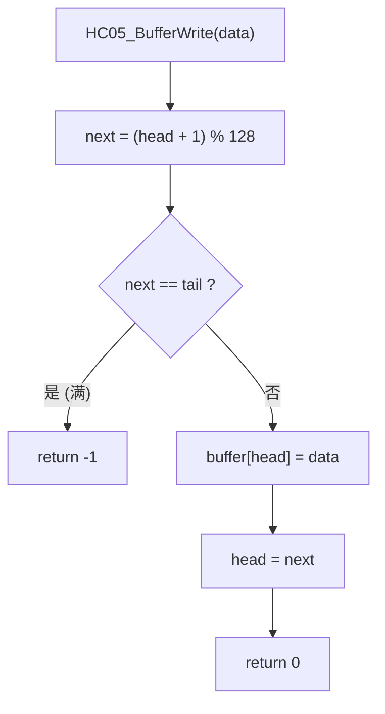
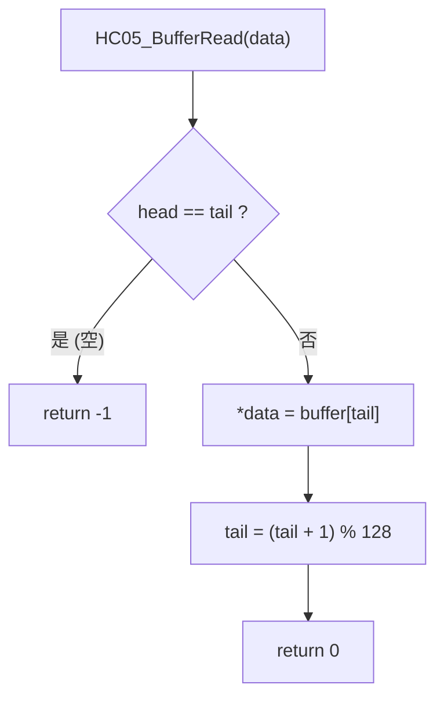

# HC-05 蓝牙驱动设计文档

> **项目**: STM32F407 智能家居 | **版本**: v0.2 | **日期**: 2026-08-02
> **依赖**: STM32F4 HAL / USART_Driver / APP_System

---

# 一、模块简介

## 1.1 HC-05 介绍

HC-05 是 Bluetooth Classic 蓝牙串口模块，在本项目中作为 STM32 USART 外设扩展，负责将蓝牙无线数据转换为 UART 有线数据，供上层协议解析。

**数据通信关系：**

```
手机 (Bluetooth Terminal App)
    │
    ▼  Bluetooth SPP
HC-05 模块
    │
    ▼  UART (TXD↔RXD)
STM32 USART3 (PB10/PB11)
    │
    ▼  RingBuffer → HC05_BufferRead()
APP_Protocol  (命令解析)
```

**职责边界**：本模块只负责数据的收发和缓存管理，**不负责任何业务逻辑**（命令解析、LED 控制、OLED 显示等由 APP 层处理）。

## 1.2 工作模式

HC-05 支持两种工作模式：

### AT 命令模式

通过 UART 发送 AT 指令配置模块参数，典型用途：

- 修改蓝牙名称：`AT+NAME=SmartHome`
- 修改配对密码：`AT+PSWD=1234`
- 修改波特率：`AT+UART=9600,0,0`
- 参数查询：`AT+VERSION?`

进入方式：上电时按住 KEY 按键（或拉高 EN 引脚），模块以 38400 波特率进入 AT 模式。

### 透传模式（本工程使用）

上电后模块自动进入透传模式。手机端发送的数据通过蓝牙 SPP 协议传输到 HC-05，HC-05 将数据原样通过 UART 发送给 STM32；STM32 发送给 HC-05 的 UART 数据也会原样通过蓝牙发送到手机。

```
手机 App ──Bluetooth──▶ HC-05 ──UART──▶ USART3 ──IRQ──▶ STM32
STM32   ──UART──▶ HC-05 ──Bluetooth──▶ 手机 App
```

---

# 二、模块职责

**HC05 驱动负责：**

- UART 数据接收（USART3 中断 + 环形缓冲区）
- UART 数据发送（单字节 / 缓冲区 / 字符串 / printf 格式化）
- 接收缓存管理（环形缓冲区读写、空满判断）
- 提供数据读写接口给上层 APP

**HC05 驱动不负责：**

- 命令解析（由 `app_protocol.c` 处理）
- LED 控制（由 `app_control.c` 处理）
- OLED 显示（由 `app_display.c` 处理）
- 参数配置（由 `app_config.c` 处理）

> **设计原则**：HC05 负责"数据搬运"，APP 负责"数据含义"。这一分层在迁移 FreeRTOS 时能保证驱动层代码几乎不需要改动。

---

# 三、硬件连接

## 3.1 引脚连接

| HC-05 引脚 | STM32F407 引脚 | GPIO | 说明 |
|-----------|-------------|------|------|
| TXD | PB11 | USART3_RX | HC-05 发送 → STM32 接收 |
| RXD | PB10 | USART3_TX | STM32 发送 → HC-05 接收 |
| VCC | 3.3V | — | 供电（HC-05 工作电压 3.3V） |
| GND | GND | — | 共地 |
| KEY | 未连接 | — | AT 模式使能（当前悬空，未使用） |
| STATE | 未连接 | — | 连接状态指示（当前悬空，未使用） |

> **注意**：KEY 和 STATE 引脚在当前版本中未连接。这意味着无法在运行时通过代码切换 AT 模式，需要在硬件上手动操作进入 AT 模式进行配置。

## 3.2 USART3 配置参数

USART3 由 CubeMX 自动生成初始化代码（`Core/Src/usart.c` 中 `MX_USART3_UART_Init()`），参数如下：

| 参数 | 值 | HAL 宏 |
|------|---|--------|
| 外设 | USART3 | — |
| 波特率 | 9600 | — |
| 数据位 | 8 | `UART_WORDLENGTH_8B` |
| 停止位 | 1 | `UART_STOPBITS_1` |
| 校验位 | 无 | `UART_PARITY_NONE` |
| 流控 | 无 | `UART_HWCONTROL_NONE` |
| 过采样 | 16 | `UART_OVERSAMPLING_16` |
| 模式 | 收发 | `UART_MODE_TX_RX` |
| NVIC 优先级 | 0:0 (最高) | `HAL_NVIC_SetPriority(USART3_IRQn, 0, 0)` |

## 3.3 USART3 中断流程

```
USART3_IRQHandler()                         [Core/Src/stm32f4xx_it.c:204]
    │
    └─ HAL_UART_IRQHandler(&huart3)         [stm32f4xx_hal_uart.c]
         │
         └─ [接收完成中断]
              └─ HAL_UART_RxCpltCallback()  [Hardware/hc05.c:123]
```

---

# 四、软件结构

## 4.1 文件组织

```
f407_learn/
├── Hardware/
│   ├── hc05.c                    # HC-05 驱动实现（中断回调 / RingBuffer / 发送）
│   ├── hc05.h                    # HC-05 驱动头文件（接口声明 / 结构体定义）
│   ├── usart_driver.c            # USART 通用驱动（底层发送 / 接收 / printf）
│   └── usart_driver.h            # USART 驱动头文件
├── Core/
│   ├── Src/usart.c               # CubeMX 生成：USART3 初始化 + MSP 配置
│   └── Src/stm32f4xx_it.c        # CubeMX 生成：USART3_IRQHandler
└── APP/
    └── app_protocol.c            # 协议层：通过 HC05_BufferRead 消费数据
```

## 4.2 模块调用关系

```
┌──────────────────┐
│  app_protocol.c  │  APP 层（命令解析 & 业务分发）
└────────┬─────────┘
         │ HC05_BufferRead() / HC05_Printf() / HC05_SendString()
         ▼
┌──────────────────┐
│     hc05.c       │  HC-05 驱动层（RingBuffer 管理 & 发送封装）
└────────┬─────────┘
         │ USART_SendByte() / USART_SendString() / USART_Printf()
         ▼
┌──────────────────┐
│  usart_driver.c  │  USART 通用驱动（HAL_UART_Transmit 封装）
└────────┬─────────┘
         │ HAL_UART_Transmit() / HAL_UART_Receive_IT()
         ▼
┌──────────────────┐
│  stm32f4xx_hal   │  STM32 HAL 库
└────────┬─────────┘
         │ 寄存器操作
         ▼
┌──────────────────┐
│   USART3 硬件     │
└──────────────────┘
```

---

# 五、初始化流程

`HC05_Init()` 由 `APP_Protocol_Init()` 在启动阶段调用。

```c
// 调用入口 [APP/app.c]
void APP_Init(void)
{
    // ...
    APP_Protocol_Init();   // → HC05_Init()
}

// [APP/app_protocol.c]
void APP_Protocol_Init(void)
{
    HC05_Init();
}
```

`HC05_Init()` 内部执行三个步骤：

```c
void HC05_Init(void)
{
    HC05_BufferInit();           // 步骤 1：初始化环形缓冲区
    HC05_StartReceive();         // 步骤 2：启动 USART3 中断接收
    APP_System_SetBTStatus(1);   // 步骤 3：标记蓝牙已就绪
}
```

**初始化流程图：**

```
APP_Init()
    │
    └─ APP_Protocol_Init()
         │
         └─ HC05_Init()                              [Hardware/hc05.c:29]
              │
              ├─ HC05_BufferInit()                   [hc05.c:60]
              │    ├─ HC05_RxBuffer.head = 0
              │    ├─ HC05_RxBuffer.tail = 0
              │    └─ memset(buffer, 0, 128)         清空缓冲区
              │
              ├─ HC05_StartReceive()                 [hc05.c:43]
              │    │
              │    └─ HAL_UART_Receive_IT(           HAL 中断接收 API
              │         &huart3,                     USART3 句柄
              │         &HC05_RxByte,                接收目标变量
              │         1)                           每次接收 1 字节
              │         │
              │         └─ [ret != HAL_OK] → USART_Printf(&huart1, "HC05 RX ERROR\r\n")
              │                                  向调试串口报告初始化失败
              │
              └─ APP_System_SetBTStatus(1)           标记蓝牙状态为"已就绪"
```

> **设计说明**：`HAL_UART_Receive_IT()` 是一次性操作——收到 1 个字节后自动停止。因此每次接收完成后必须在 `HAL_UART_RxCpltCallback()` 中重新调用它，形成"中断链"。

---

# 六、UART 接收流程（重点）

## 6.1 总体架构

当前采用 **UART 中断 + 环形缓冲区（RingBuffer）** 方案：

```
┌─────────────────────────────────────────────────────┐
│                    接收数据流                          │
│                                                       │
│  手机 App ──BT──▶ HC-05 ──UART──▶ USART3 RX 引脚      │
│                                        │               │
│                                   硬件触发中断          │
│                                        │               │
│                                   USART3_IRQHandler   │
│                                        │               │
│                              HAL_UART_IRQHandler()    │
│                                        │               │
│                            HAL_UART_RxCpltCallback()  │
│                                    │       │           │
│                         存入 RingBuffer   重新启动中断  │
│                                    │                   │
│                              APP_Protocol_Process()   │
│                              (主循环中轮询读取)          │
└─────────────────────────────────────────────────────┘
```

## 6.2 关键实现：中断回调

`HAL_UART_RxCpltCallback()` 是整个接收流程的核心。它定义在 `hc05.c` 中，**覆盖**了 HAL 库的 `__weak` 默认实现：

```c
void HAL_UART_RxCpltCallback(UART_HandleTypeDef *huart)
{
    /* 判断是否为 HC-05 对应的 USART3 */
    if (huart->Instance == USART3)
    {
        /* 将收到的字节写入环形缓冲区 */
        if (HC05_BufferWrite(HC05_RxByte) != 0)
        {
            /* 缓冲区已满——当前静默丢弃，后续可增加溢出计数 */
        }

        /* ★ 关键：重新启动中断接收，否则后续数据无法接收 */
        HAL_UART_Receive_IT(HC05_UART,
                            &HC05_RxByte,
                            1);
    }
}
```

> **核心设计点**：每收到 1 个字节，回调会立刻重新调用 `HAL_UART_Receive_IT()` 启动下一次接收。如果忘记这一步，接收将永久停止——这是 STM32 HAL 中断接收机制的最常见陷阱。

## 6.3 主循环消费

`APP_Protocol_Process()` 在主循环中每次迭代都会尝试从 RingBuffer 读取数据：

```c
// [APP/app_protocol.c]
void APP_Protocol_Process(void)
{
    uint8_t ch;
    while (HC05_BufferRead(&ch) == 0)   // 循环直到缓冲区为空
    {
        APP_Protocol_Input(ch);         // 逐字节输入到命令解析器
    }
}
```

---

# 七、RingBuffer 设计

## 7.1 数据结构

```c
// [Hardware/hc05.h:22-33]
typedef struct
{
    uint8_t buffer[HC05_RX_BUFFER_SIZE];  // 数据缓冲区 (128 字节)
    volatile uint16_t head;               // 写指针（ISR 中修改，标记 volatile）
    volatile uint16_t tail;               // 读指针（主循环中修改，标记 volatile）
} HC05_RingBuffer_t;
```

| 字段 | 修饰符 | 修改者 | 说明 |
|------|--------|--------|------|
| `buffer[128]` | — | ISR (写) / 主循环 (读) | 数据存储空间 |
| `head` | `volatile` | **ISR** (`HC05_BufferWrite`) | 下一次写入的位置 |
| `tail` | `volatile` | **主循环** (`HC05_BufferRead`) | 下一次读取的位置 |

> `volatile` 修饰保证 ISR 对 `head` 的修改能立即被主循环看到，避免编译器优化导致的数据不一致。

## 7.2 空/满判断

```c
#define HC05_RX_BUFFER_SIZE  128U
```

| 状态 | 判断条件 | 说明 |
|------|---------|------|
| **空** | `head == tail` | 读指针追上写指针，无数据可读 |
| **满** | `(head + 1) % 128 == tail` | 写指针即将追上读指针，**实际可用容量 = 127** |

> **设计取舍**：为了区分"空"和"满"，牺牲 1 字节容量。当 `next == tail` 时判定为满，此时 `head == tail` 唯一对应"空"。如果装满 128 字节，`head` 会绕回并等于 `tail`，无法与空状态区分。

## 7.3 写入流程

```c
int HC05_BufferWrite(uint8_t data)
{
    uint16_t next;

    /* 1. 计算下一个 head 位置（环形递增） */
    next = (HC05_RxBuffer.head + 1) % HC05_RX_BUFFER_SIZE;

    /* 2. 判断是否已满 */
    if (next == HC05_RxBuffer.tail)
    {
        return -1;   // 缓冲区满，写入失败
    }

    /* 3. 写入数据到当前 head 位置 */
    HC05_RxBuffer.buffer[HC05_RxBuffer.head] = data;

    /* 4. 更新 head 指针 */
    HC05_RxBuffer.head = next;

    return 0;   // 写入成功
}
```



## 7.4 读取流程

```c
int HC05_BufferRead(uint8_t *data)
{
    /* 1. 判断是否为空 */
    if (HC05_RxBuffer.head == HC05_RxBuffer.tail)
    {
        return -1;   // 缓冲区空，读取失败
    }

    /* 2. 读取 tail 位置的数据 */
    *data = HC05_RxBuffer.buffer[HC05_RxBuffer.tail];

    /* 3. 更新 tail 指针（环形递增） */
    HC05_RxBuffer.tail =
        (HC05_RxBuffer.tail + 1) % HC05_RX_BUFFER_SIZE;

    return 0;   // 读取成功
}
```



---

# 八、发送流程

HC05 模块提供 4 种发送接口，全部通过 `HC05_UART` 宏（即 `&huart3`）将数据转发到底层 `USART_Driver`：

## 8.1 单字节发送

```c
HAL_StatusTypeDef HC05_SendByte(uint8_t data)
{
    return USART_SendByte(HC05_UART, data);
}
// → HAL_UART_Transmit(&huart3, &data, 1, 100ms超时)
```

## 8.2 缓冲区发送

```c
HAL_StatusTypeDef HC05_SendBuffer(const uint8_t *buf, uint16_t len)
{
    return USART_SendBuffer(HC05_UART, buf, len);
}
// → HAL_UART_Transmit(&huart3, buf, len, HAL_MAX_DELAY)
```

## 8.3 字符串发送

```c
HAL_StatusTypeDef HC05_SendString(const char *str)
{
    return USART_SendString(HC05_UART, str);
}
// → HAL_UART_Transmit(&huart3, str, strlen(str), HAL_MAX_DELAY)
```

## 8.4 printf 格式化发送

```c
HAL_StatusTypeDef HC05_Printf(const char *fmt, ...)
{
    char buffer[128];
    va_list args;

    va_start(args, fmt);
    vsnprintf(buffer, sizeof(buffer), fmt, args);
    va_end(args);

    return USART_SendString(HC05_UART, buffer);
}
// → USART_SendString → HAL_UART_Transmit(&huart3, buffer, strlen(buffer), HAL_MAX_DELAY)
```

> **注意**：`HC05_Printf` 内部使用 128 字节栈缓冲区，格式化结果超过 128 字节会被 `vsnprintf` 截断。

**发送数据流：**

```
APP 层
    │ HC05_Printf("LED ON OK\r\n")
    ▼
HC05_Printf()  →  vsnprintf 格式化到 buffer[128]
    │
    ▼
HC05_SendString()  →  USART_SendString(&huart3, buffer)
    │
    ▼
HAL_UART_Transmit(&huart3, buffer, len, HAL_MAX_DELAY)
    │
    ▼
USART3 TX (PB10)  ──UART──▶  HC-05  ──Bluetooth──▶  手机 App
```

> **阻塞行为**：所有发送函数底层使用 `HAL_UART_Transmit()`（阻塞模式），发送期间 CPU 等待完成。后续 FreeRTOS 迁移时可改为 DMA + 信号量方式避免阻塞。

---

# 九、接口总结

| 函数 | 返回值 | 作用 | 调用者 |
|------|-------|------|--------|
| `HC05_Init()` | `void` | 初始化 RingBuffer + 启动中断接收 + 设置蓝牙就绪 | `APP_Protocol_Init()` |
| `HC05_StartReceive()` | `void` | 调用 `HAL_UART_Receive_IT` 启动单字节中断接收 | `HC05_Init()` / 回调中重启 |
| `HC05_BufferInit()` | `void` | 清零 head/tail + 清空 buffer | `HC05_Init()` |
| `HC05_BufferWrite(uint8_t data)` | `int` (0 成功 / -1 满) | ISR 中将接收字节写入环形缓冲区 | `HAL_UART_RxCpltCallback` |
| `HC05_BufferRead(uint8_t *data)` | `int` (0 成功 / -1 空) | 主循环中从环形缓冲区读取一个字节 | `APP_Protocol_Process()` |
| `HC05_SendByte(uint8_t data)` | `HAL_StatusTypeDef` | 阻塞发送单字节 | APP 层 |
| `HC05_SendBuffer(const uint8_t *buf, uint16_t len)` | `HAL_StatusTypeDef` | 阻塞发送指定长度数据 | APP 层 |
| `HC05_SendString(const char *str)` | `HAL_StatusTypeDef` | 阻塞发送字符串 | APP 层 (所有 `APP_Cmd_*` 函数) |
| `HC05_Printf(const char *fmt, ...)` | `HAL_StatusTypeDef` | 阻塞发送格式化字符串 | APP 层 (所有 `APP_Cmd_*` 函数) |
| `HC05_ReceiveByte(uint8_t *data)` | `HAL_StatusTypeDef` | 阻塞接收单字节（**当前未使用**） | 预留接口 |

---

# 十、开发过程中遇到的问题

## 1. 波特率不匹配

**现象**：手机连接 HC-05 成功后，发送数据但 STM32 收不到任何内容。

**原因**：HC-05 出厂默认波特率为 9600，而早期版本 USART3 可能被配置为 115200。两端波特率不一致导致数据解析失败。

**解决**：将 USART3 波特率统一为 9600（`Core/Src/usart.c:72`）。如果需要在工程中修改 HC-05 波特率，必须先通过 AT 命令修改模块参数，再同步修改 STM32 端 USART3 配置。

## 2. 忘记在回调中重新调用 HAL_UART_Receive_IT()

**现象**：上电后第一次接收正常（能收到 `\r\n`），之后再也无法接收新数据。

**原因**：HAL 的中断接收 API `HAL_UART_Receive_IT()` 是一次性操作——接收完指定数量（1 字节）的数据后自动退出中断接收模式。如果在 `HAL_UART_RxCpltCallback()` 中没有重新调用它，后续不会再触发 USART3 中断。

**正确做法**（当前代码实现）：

```c
void HAL_UART_RxCpltCallback(UART_HandleTypeDef *huart)
{
    if (huart->Instance == USART3)
    {
        HC05_BufferWrite(HC05_RxByte);

        // ★ 必须：重新启动下一次中断接收
        HAL_UART_Receive_IT(HC05_UART, &HC05_RxByte, 1);
    }
}
```

## 3. 不应在中断中处理业务逻辑

**错误设计**（本项目未采用）：

```
USART3 中断
    ↓
解析命令              ← 中断上下文，耗时操作
    ↓
控制 GPIO             ← 潜在外设冲突
```

**正确设计**（本项目实际采用）：

```
USART3 中断
    ↓
HC05_BufferWrite()    ← 仅写入缓存，极快 (< 1μs)
    ↓
[退出中断]
    ↓
APP_Protocol_Process() ← 主循环中处理，可阻塞
    ↓
命令解析 / 控制
```

> **原则**：ISR 只做"数据搬运"（写入 RingBuffer），所有"数据处理"（解析 + 执行）留给主循环。这既保证中断响应速度，也避免中断嵌套和锁竞争问题。

## 4. RingBuffer 容量问题

**设计要点**：使用 `head/tail` 双指针时，必须牺牲 1 字节区分空/满。当前 `HC05_RX_BUFFER_SIZE = 128`，**实际可用容量 = 127 字节**。

**满判断**：`(head + 1) % 128 == tail` → 此时 buffer 中有 127 字节数据，但第 128 次写入会返回 `-1`。

**当前处理**：缓冲区满时，`HC05_BufferWrite()` 静默丢弃数据（返回 `-1`），`HAL_UART_RxCpltCallback` 中只注释了 `/* Buffer Full */`，**未做溢出计数或告警**。后续可以增加 `overflow_count` 统计变量。

---

# 十一、APP 调用关系

## 当前数据流

```
HC-05 (蓝牙无线)
    │
    ▼  USART3 中断
RingBuffer (HC05_RxBuffer)
    │
    ▼  HC05_BufferRead() 轮询
APP_Protocol_Process()            [app_protocol.c:41]
    │
    ▼  APP_Protocol_Input(ch)
命令解析 (APP_Protocol_Parse)
    │
    ├── "LED ON"    → APP_Control_LED(ON)       [app_control.c]
    ├── "LED OFF"   → APP_Control_LED(OFF)      [app_control.c]
    ├── "PAGE HOME" → APP_Display_SetPage()     [app_display.c]
    ├── "STATUS"    → APP_Sensor_GetData() 等   [app_sensor/system.c]
    ├── "INTERVAL"  → APP_Config_Set + Save     [app_config.c]
    └── "OLED CLR"  → APP_Display_Clear()       [app_display.c]
```

## 实例：手机发送 `LED ON`

```
[手机 Bluetooth Terminal]
    │  输入 "LED ON\r"
    ▼
HC-05 模块
    │  UART: 0x4C 'L', 0x45 'E', 0x44 'D', 0x20 ' ', 0x4F 'O', 0x4E 'N', 0x0D '\r'
    ▼
USART3 中断 × 7 次（每字节触发一次 ISR）
    │  → HAL_UART_RxCpltCallback → HC05_BufferWrite × 7
    ▼
RingBuffer (7 字节)
    │
主循环轮询 HC05_BufferRead × 7 → APP_Protocol_Input
    │
'\r' 触发解析 → APP_Protocol_Parse("LED ON")
    ├─ 分割: cmd="LED", param="ON"
    └─ 匹配 APP_CommandTable → APP_Cmd_LED("ON")
        └─ APP_Control_LED(APP_LED_ON)
            └─ LED_On() → HAL_GPIO_WritePin(GPIOC, PIN13, 低电平)
                HC05_Printf("LED ON OK\r\n") → 手机收到回复
```

---

# 十二、FreeRTOS 迁移注意事项

## 当前架构（裸机）

```
USART3 ISR
    │
    ▼
HC05_BufferWrite() → RingBuffer
    │
    ▼ (主循环轮询)
APP_Protocol_Process() → 解析 & 执行
```

## 迁移目标架构（FreeRTOS）

```
USART3 ISR
    │
    ▼
xQueueSendFromISR() → FreeRTOS Queue
    │
    ▼ (任务阻塞等待)
ProtocolTask → 解析 & 执行
```

## 迁移要点

| 组件 | 迁移策略 |
|------|---------|
| **USART3 中断接收** | **保持** `HAL_UART_Receive_IT()` 机制不变 |
| **RingBuffer** | 可替换为 FreeRTOS Queue（天然线程安全），或保留当前 `HC05_RingBuffer_t` + 添加互斥锁 |
| **中断回调** | 将 `HC05_BufferWrite()` 替换为 `xQueueSendFromISR()`，注意使用 `portYIELD_FROM_ISR()` |
| **协议解析** | 从主循环轮询 `HC05_BufferRead()` 改为独立 Task 阻塞等待 `xQueueReceive()` |
| **发送函数** | `HC05_Printf` / `HC05_SendString` 底层为阻塞发送，多任务环境下需加互斥锁，或改为 DMA 发送 + 信号量通知 |
| **APP_System_SetBTStatus** | 当前在 `HC05_Init()` 中直接调用，迁移后如果 ProtocolTask 尚未创建，需要调整初始化时序 |

> **关键原则**：当前裸机代码中"ISR → 缓存 → 主循环处理"的设计已符合 RTOS 思想。迁移时主要是将 RingBuffer 换为 Queue，主循环轮询换为 Task 阻塞——驱动层和协议层的核心逻辑几乎不需要修改。

---

# 十三、本章总结

当前 HC-05 蓝牙驱动已实现以下功能：

- ✅ USART3 9600-8-N-1 通信（CubeMX 初始化）
- ✅ 中断接收（单字节 `HAL_UART_Receive_IT` + 自动重启链）
- ✅ 环形缓冲区缓存（128 字节，head/tail 双指针）
- ✅ 阻塞发送（单字节 / 缓冲区 / 字符串 / printf 格式化）
- ✅ 中断回掉中零业务逻辑（仅存入 RingBuffer）
- ✅ 与 APP 协议层无缝连接（`HC05_BufferRead` 轮询消费）
- ✅ USART3 中断硬件验收（NVIC 优先级 0:0）

**当前未实现 / 待完善：**

- ⚠️ KEY/STATE 引脚未连接（无法软切换 AT 模式）
- ⚠️ `HC05_ReceiveByte()` 阻塞接收接口预留但未使用（主循环用中断+RingBuffer 替代）
- ⚠️ 缓冲区满时静默丢弃，无溢出计数
- ⚠️ 发送为阻塞模式，大数据量时占用 CPU

**核心设计思想：**

> **"中断负责快速接收，缓存负责数据保存，APP 负责业务处理。"**

这三层分离保证了：
1. **实时性**：ISR 执行时间极短（仅写入 RingBuffer）
2. **可维护性**：驱动层与业务层解耦，修改命令协议不需要动驱动代码
3. **可移植性**：该设计已兼容 RTOS 的 ISR→Queue→Task 模式，未来迁移几乎零改动
